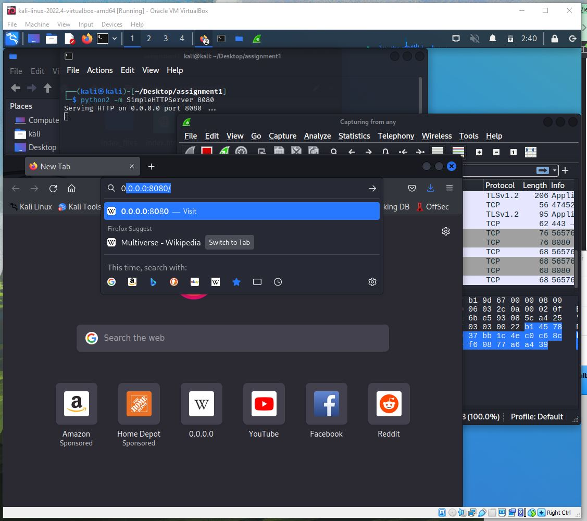

## Cristian Cortez
## ID: if2482
## CS 471: Security & Info Assurance
# Assignment 1

## **Abstract**

The purpose of this assignment is to capture and read network traffic to determine what information is exposed during transmission. We will create and capture our own un-encrypted network traffic. After capture, packets are examined by hand in order to read content. This effort demonstrates the dangers of exposing un-encrypted content along a network connection.

## **Introduction**

Within a kali Linux VM instance, **`netcat`** will be used to create a connection and read and write a plaintext message. Also, a python web server instance will be used to host a local html page saved from the internet. The **`Wireshark`** tool will be used to capture and read these two kinds of packet traffic. Then, by hand, each packet will be opened and examined to understand what elements are exposed while in transit.

Commands used:

### NETCAT

    // listener
    $ nc -l 10.0.2.15 -p 31337

    // connect
    $ nc 10.0.2.15

### PYTHON WEB SERVER

    // start server
    $ python2 -m SimpleHTTPServer 8080

  
  
  

## **Summary of Results**

### **NETCAT**

1. **Starting Wireshark within Kali Linux VM instance.**

<!--  -->

2. **Select *any* to capture traffic across any network adaptor and begin listening.**

<!--  -->
  

3. **Start two instances of the terminal (listener and connector).**

Run

    nc -l 10.0.2.15 -p 31337

in the first terminal (listener) and

    nc 10.0.2.15 31337

in the second terminal (sender).

These two commands will begin a connection between the terminals across the network. Notice, the 3-packet TCP handshake populated the view within wireshark.

<!--  -->

  
  
  

4. **From the sender, type a plaintext message and hit enter to send the message to the listener.**

The message will appear in the listener console.

<!--  -->

5. **In Wireshark, search for the TCP packet that contains the plaintext message sent from the sender.**

The message will appear in the bottom right of the packet info. This shows that plaintext data, when sent unencrypted over a network connection, can be anyone who intercepts the packet.

<!--  -->

### **PYTHON WEB SERVER PT.1: DOWNLOAD WEBPAGE INDEX FILES**

1. **Open a web browser and navigate to a favorite webpage (I recommend a wiki on something interesting)**

<!--  -->

2. **Right click on the page and select "`Save Page As`".**

Some packets may already avaliable but do not contain relevent assignment information.

<!--  -->

3. **Navigate to a folder and save the page as "`index.html`"**

This will also save the webpage assets within a folder called "`index_files`".

<!--  -->

### **PYTHON WEB SERVER PT.2: WIRESHARK AND SELF-HOSTED WEBPAGE**

1. **Open a new terminal and navigate to the folder with the save index files.**

<!--  -->

2. **Start the python web server**

Run

    python2 -m SimpleHTTPServer 8080

<!--  -->

3. **Start wireshark and select *any* adapter to begin listening for packets.**

<!--  -->

4. **In th URL bar of the web browser, enter the IP Address and Port number the python server is hosted on.**

<!--  -->

5. **Select Enter to view the conent of self-hosted webpage**

<!--  -->

  

6. **Within Wireshark, try and find a packet with URL informtation.**

This might take a while. Here is one I found that has some HTML info (packet No. 84). In this case, HTML is not sent encrypted, so it is exposed as plaintext within the packet.

<!--  -->

## **Conclusion**

Through packet analysis of two separate network connections, it was found that certain plaintext messages are exposed as apart of packet information. The message sent within the  **`netcat`** connection made between two terminals was easily intercepted and exposed by Wireshark. Similarly, the HTML page of our **`self-hosted webpage`** was also exposed within the packet information intecepted by Wireshark. If nothing more, this proves two things: One, that packet info should never be assumed to be secure and Two, that wireshark is a powerful, almost scary, kind of a tool.

Wireshark is a network packet capture and analysis tool. It is used for capturing packets along a network connection so that an analysis can be conducted. This is useful for security, as well as malicious, purposes. For example, imagine a slow webserver is suspected to be a victim of a DDoS attack, such as an amplification attack. Wireshark could be used to analyze the size and volume of these packet responses and determine wether or not an attack was occuring.

Using Wireshark taught me that HTML information (webpages, stylesheets, other HTML and HTML-adjacent pages, etc.) are readily avaliable within packet info. I would have assumed that in our modern computing era, webpages would be harder to find such as hidden behind a simple cipher. However, if this was the case, it would require clients to decypher content which might be too resource intensive for some systems.
