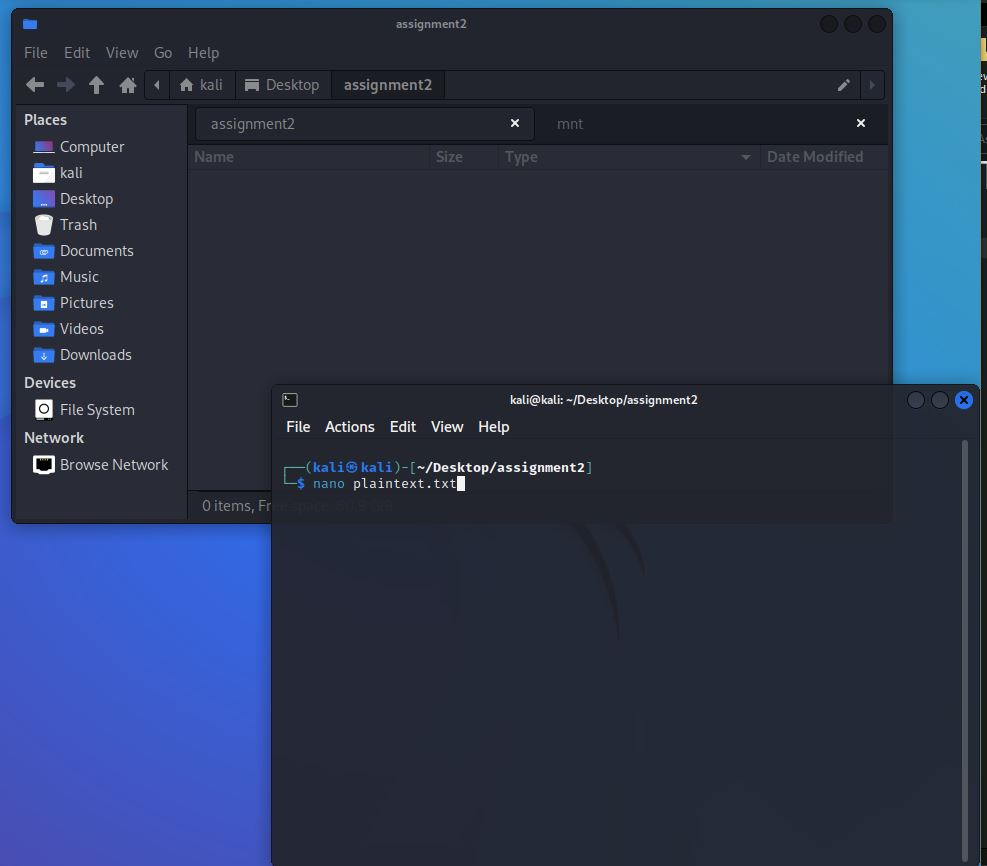
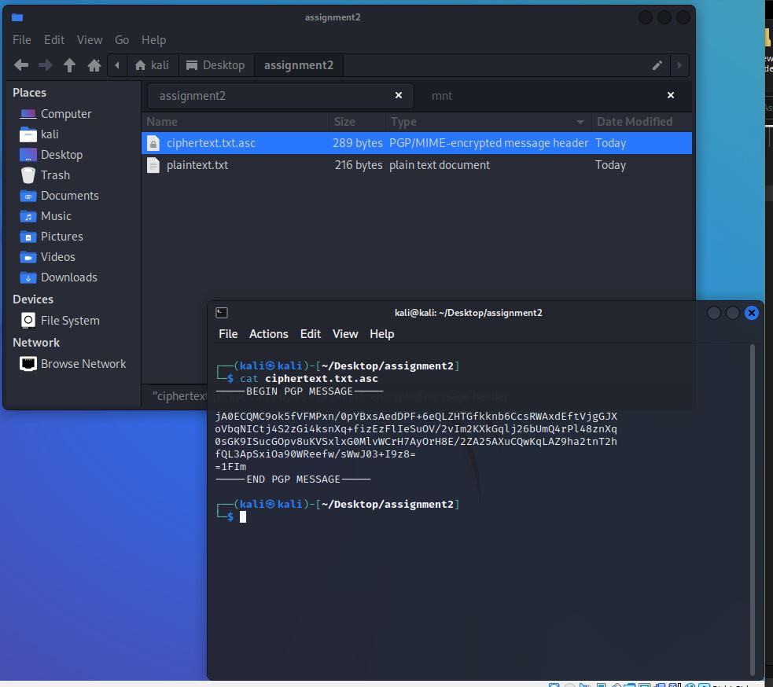
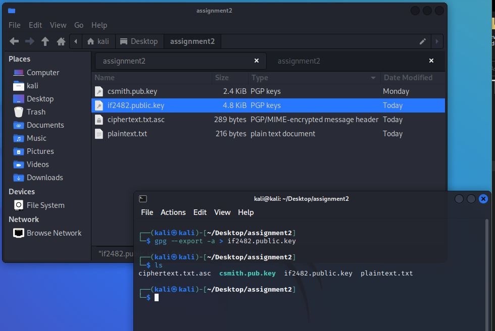

## Cristian Cortez
## ID: if2482
## CS 471: Security & Info Assurance
# Assignment 2

## **Abstract**

In this assignment, we experiment with encyption, hashing, packet caputure and analysis using the tools gpg, netcat, wireshark, steghide, and md5sum. The purpose of this assignment is to understand the fundmentals of encryption and hashes and how each provide the X.800 Secuirty Services of authentication, access control, data confidentiality, data-integrity and non-repudiation. As a result; gpg provides Confidentiality, Authentication and non-repudiation; netcat provides weak non-repudiation; steghide provides confidentiality and data-integrity; md5sum provides data-integrity.

## **Introduction**

Within a kali linux vm, gpg will be used to symmetrically and asymmetrically encrypt a plaintextfile. Gpg will also be used to sign the encrypted message with a private key to authenticate us as the encryptor. netcat will be used to send the ciphertext file and recieve and save it within another file. This connection will be monitored with wireshark where a packet analysis will later prove how that data is transfered over a network connection. steghide will be used to embed the plaintext file within an image downloaded from the internet. These image files (the original and the one with the embeded message), will be check with md5sum. md5sum will calculate these hash values for these image files to prove that data was modified, breaking the data-integrity between them.

Commands used:

### NIX GENERAL

    // create a file with a message
    $ echo "[MESSAGE]" >> [PLAINTEXT FILE].txt

    // create a file with nano
    $ nano [PLAINTEXT FILE].txt

    //change permission on a file
    $ chmod 600 [FILE].txt

    // rename a f1 to f2
    mv [FILE1].txt [FILE2].txt

    // Display contents of a file
    $ cat [FILE].txt

    //Display manual for a command
    $ man [COMMAND NAME]

    // Download an image jpeg from a URL
    $ wget [IMAGE URL].jpeg && cp [IMAGE URL NAME].jpeg image.jpg

### GPG

    // ENCRYPTION:

        // Symmetric encryption: binary output
        $ gpg --symmetric [PLAINTEXT FILE]

        // Symmetric encryption: ASCII output (armored)
        $ gpg --symmetric -a [PLAINTEXT FILE]

        //Decrypt
        $ gpg --decrypt [CIPHERTEXT FILE].txt.asc

        //Encrypt signed file to the recipient's key
        $ gpg -e -a -u "[YOUR NAME]" -r "Christopher" plaintext.txt.asc.sig

    // GPG KEYRING:

        // Import public key to key ring
        $ gpg --import [PUBLIC KEY].pub.key

        // List imported keys in local keyring
        $ gpg --list-keys

        // Export public key in ASCII format (armored)
        $ gpg --export -a > [public].key
    
    // GPG KEYGEN

        // Create a public/private key pair
        $ gpg --gen-key
    
    // GPG SIGNING

        // Sign the plaintext with private key
        $ gpg -a --output [PLAINTEXT FILE].txt.asc.sig --sign plaintext.txt
    
    //

### NETCAT

    // Setup prearranged listener
    $ nc -l -p 31337 -q 1 > [CIPHERTEXT FILE].txt.asc < /dev/null

    // Send encrypted file to listener
    $ cat [CIPHERTEXT FILE].txt.asc | netcat 192.168.86.220 31337

### STEGHIDE

    // Install
    $ sudo apt-get install steghide

    // Embed a plaintext message in an image file
    $ steghide embed -cf image.jpg -ef plaintext -sf steg_image.jpg

    // Extract plaintext message from an image file
    $ steghide extract -sf steg_image.jpg

### MD5

    // get md5sum of a file with extension jpg/jpeg
    $ md5sum [FILE].jpg
    $ md5sum [FILE].jpeg

  

## **Summary of Results**

### **A: Create a plaintext file**

1. ***Create a plain text name "`plaintext.txt`" file with the following text:***

    [YOUR NAME]\
    [NETID]\
    [A MESSAGE]

Use either `echo` or `nano` to create the file.

Mine looks like:\
"`plaintext.txt`"

    Cristian Cortez
    if2482
    All work and no play makes Cristian a dull boy.
    All work and no play makes Cristian a Dull boy.
    All work and no plAy makes Cristian a dull boy.
    All work and no play make$ Cri$tian a duLL bot.

### **B: GPG symmetric/asymmetric encryption**

1. ***Encrypt the plaintext file with symmetric encryption in ASCII armored format using password "`letmein`". Rename the encrypted file "`ciphertext.txt.asc`" and print contents.***

Use commands:

    $ gpg --symmetric -a plaintext.txt
    $ mv plaintext.txt.asc ciphertext.txt.asc
    $ cat ciphertext.txt.asc

Create the cipher text

Print the contents of the ciphertext file.

Mine looks like:\
"`ciphertext.txt.asc`"

    -----BEGIN PGP MESSAGE-----

    jA0ECQMC9ok5fVFMPxn/0pYBxsAedDPF+6eQLZHTGfkknb6CcsRWAxdEftVjgGJX
    oVbqNICtj4S2zGi4ksnXq+fizEzFlIeSuOV/2vIm2KXkGqlj26bUmQ4rPl48znXq
    0sGK9ISucGOpv8uKVSxlxG0MlvWCrH7AyOrH8E/2ZA25AXuCQwKqLAZ9ha2tnT2h
    fQL3ApSxiOa90WReefw/sWwJ03+I9z8=
    =1FIm
    -----END PGP MESSAGE-----

2. ***Import provided public key `csmith.pub.key` into the gpg keyring. Display the list of keys in the gpg keyring.***

Use commands:

    $ gpg --import csmith.pub.key
    $ gpg --list-keys

If the key is not already present, navigate to the folder with the public key.\
List the current keys within the key ring. If you do not have a key ring, a key ring will be generated for you (as in my case).

Import the provided public key.

Now list the keys in the gpg keyring. You should see a new entry for the public key added.

3. ***Create a public/private key pair. Remeber to **SAVE YOUR PASSWORD!** Display the gpg key ring keylist.***

<!-- SAVED PASSWORD: superduper -->

Use commands:

    $ gpg --gen-key
    $ gpg --list-keys

Generate the private/public key pair. A prompt will ask you to enter A name, an email, and a password. A summary will then be provided (as shown below).

List the keys in the key ring. Notice the new public key added to the key ring.

4. ***Export the public key generated as ASCII armored format. Name the file [YOUR NETID].public.key. Display the contents of the exported key.***

Use commands:

    $ gpg --export -a > if2482.public.key
    $ cat if2482.public.key

Export the public key

Display the contents within the public key.

5. ***Sign the plaintext file created earlier with the generated private key. Remember to **NOT SHARE YOUR PRIVATE KEY!*****

Use commands:

    $ gpg -a --output plaintext.txt.asc.sig --sign plaintext.txt

Sign the plaintext file. A prompt will ask you for the password created earlier (shown below).

After, you can display the signed file with "`cat`". My result is below.

6. ***Encrypt the signed file with ASCII output using the key.***

Use commands:

    $ gpg -e -a -u "Cristian" -r "Christopher" plaintext.txt.asc.sig

Encrypt the signed file with the key. A prompt will ask you if are certain that you know the userID is certainly associated with the key. Answer yes.

### **C: NETCAT encrypted text transmission**

1. ***Start 2 instances of the terminal (one for listener, one for sender)***

2. ***Start wireshark and select "`any`" adapter.***

3. ***In one terminal, create a listener. In the other terminal create a sender.***

The listener will capture the data and save within a file named "`ciphertext.txt.asc`". The sender will send the output of `cat` to the listener via the TCP channel.\
Wireshark will start to pickup the traffic.

Use Commands:

    // listener
    $ nc -l -p 31337 -q 1 > ciphertext.txt.asc < /dev/null

    // sender
    $ cat ciphertext.txt.asc | netcat 192.168.86.220 31337

PLEASE NOTE: I could not get my sender to send the data. Packet analysis shows that there was various TCP retransmissions and ports were reused. This indicates that a connection between the sender and the listener was never established. I looked for the TCP handshake and could not find one. This connection was never completed.

Eventually, the sender waits long enough to recieve a "connection timeout" message.

### **D: STEGHIDE emded plaintext.txt within jpeg**

1. ***Install Steghide if not already installed.***

Use Commands:

    $ sudo apt-get update
    $ sudo apt-get install steghide
    $ man steghide
    $ steghide

First, do a system update. Enter the password for system to update.

Next, install steghide. Enter "`y`" when prompted to continue the install.

2. ***Download an image either from the terminal or by hand through a web browser.***

From the steghide manual: the only supported file types for embeding are: AU, BMP, JPEG or WAV. This would make BMP and JPEG the only images capable of text embeds.

PLEASE NOTE: Ensure your image is of the supported types. It will not work with anything else.

Use Commands:

    $ wget https://upload.wikimedia.org/wikipedia/commons/f/f3/Calabi_yau.jpg && cp Calabi_yau.jpg image.jpg

For this assignment, I decided to download from the terminal. First browse online for an image and copy that URL.

3. ***Embed the plaintext file created earlier into the jpeg image. **Use password "`letmein`" to embed the image.*****

Use Commands:

    $ man steghide
    $ steghide embed -cf image.jpg -ef plaintext.txt -sf steg_image.jpg

4. ***Extract the plaintext message and display its contents.***

Use Commands:

    $ steghide extract -sf steg_image.jpg

The extraction will always save the extracted data within a file name equal to the name of the file used to embed. Later we will be comparing both files for integrity; So we cannot overwrite the original file.\
The extraction will prompt you to "overwrite" an existing file. Answer "`No`".

Because of this, I recommend 2 possibilities:

1. Rename original plaintext file "`original-plaintext.txt`"
2. Mv the file to the another folder.

I choose the first option and renamed my original plaintext.

As you can see in the screengrab, the two files are the same size, which would suggest the have similar hashings.

### **E: MD5 hash comparison of embded/extracted plaintext files aswell as jpeg files with, without embeded and renamed original images.**

#### **Plaintext Files**

1. ***Use md5 tool to get the checksum for both the embeded and the extracted plaintext file versions.***

Use Commands:

    $ md5sum original-plaintext.txt
    $ md5sum plaintext.txt

Compare the computed hashes. Mine look something like this:

    $ md5sum original-plaintext.txt
    e0bfaf4ab10de38004a3bc071285365d  original-plaintext.txt

    $ md5sum plaintext.txt
    e0bfaf4ab10de38004a3bc071285365d  plaintext.txt

In my case, the hashes are identitcal. When an image is embeded with a message, that message is encrypted using Rijndael AES 128 bit encryption. Encryption has a two-way characteristic in that a cyphertext can be decrypted to preserve the original message. It would makes sense then that these messages produce the same hash.

#### **Original/Embeded/Renamed Image Files**

2. ***Use md5 tool to compare the checksums for both the original image aswell as the image with the embeded message.***

Use commands:

    // make a copy of original
    $ cp image.jpg cpy_image.jpg

    // original without embeded message
    $ md5sum image.jpg
    
    // original renamed
    $ md5sum cpy_image.jpg
    
    // embeded with message
    $ md5sum steg_image.jpg

Make copy of the original image file.

Compare the hash values for the files. Mine look like:

    $ md5sum image.jpg
    f9acc2780db1ac277098247f86620156  image.jpg
 
    $ md5sum cpy_image.jpg
    f9acc2780db1ac277098247f86620156  cpy_image.jpg

    $ md5sum steg_image.jpg
    4584fe89327cbb614f9a4ba48a2f1cb9  steg_image.jpg

As we can see, the original image shares its hash value with only the copy image and not with the embeded image.\
This implies two things:

1. File names do not contribute to the file hash value. This would allow for files to be copied but **still hold integrity** in that data is not modified.

2. Embedding an image modifies the image data. This means that **image data integrity is not held** when embedding a message. This could be usefull in detecting images that have been maliciously modified.

## **Conclusion**

In this assignment, we expiremented with various security tools including: gpg, netcat, wireshark, steghide and md5sum. Gpg was used to encrypt and decrypt a plaintext file. Both symmetric and asymmetric encryption was used. Also, we practiced signing an ecrypted file with a private key, which when decrypted with a public key would validate us as the encryptor. Netcat and Wireshark were then used to send the encrypted text, capture it and analyze the packets for data contents. Next, steghide was used to embed plaintext data within an image file. This was used to demonstrate how data can seemly be included in files by going unnoticed. Lastly, md5sum was used to check hash values of various files. These files were then checked to verify data had been embeded within. If the hash had been the same, then data held its intrgity. Since they were not (image vs image with embeded message), data integrity was not held.

Before describing how each tool used in this assignment provides or does not provide the X.800 Secuirty Services, lets take a brief moment to define them.

1. *Authentication*: ensures that all parties involved in a data access or connection are who they say they are.
2. *Access Control*: the ability to limit and control access to system resouces through secuirty policies and mechanisms.
3. *Data Confidentiality*: prevents unauthorized data acess.
4. *Data-Integrity*: provides assurance that total data streams remain unchanged by unauthorized entities.
5. *Non-repuditation*: protects against denial of involvement within a connection.

### **gpg: Confidentiality, Authentication, Non-repudiation**

The OpenPGP tool provides encryption. Encrytpion typically supports *confidentiality* because only authorized entities that have the key to decrypt would be able todo so. However, encryption would not provide authentication alone. As we can see within symmetric encryption exercise, ciphertexts are enc/dec with the same key. Therefore, it is impossible to prove authentication since authentication requires the signature of a private key (one of the eys within asymmetric key pairs).

Authentication is provided by signatures, or a hash value. Hash values also provide data integrity, so an encryption tool like gpg would not support it alone. In this assignment, we signed a plaintext file with our private key. We then submitted our public key so that our message could get decrypted. Decrypting the message with our public key will produce our plaintext message. By doing that, it provides *authentication* that we are the ones who encrypted it. If after decrypting, the plaintext message was something entirely different, then the private/public key pair would not match and therefore break authentication of our identity. In this way, since private keys are only known to the owner, a sucessful decryption verifies it was signed by the private key, which is a form of *non-repudiation*

gpg encryption does not provide access control or data-integrity. The tool would need:

1. access control: A way to create a security policy
2. data-integrity: A way to create file hashes

### **netcat: Non-repudiation (weak)**

Netcat is a tool that "reads and writes data across network connections" (netcat manual). It creates a TCP connection between a sender and a reciever.

In this lab, netcat does not provide any authentication. So long as someone knows the host address and port number, a connection can be made without entity authentication. Similarly, netcat does not provide access control beyond that of a firewall.

The TCP connection made by netcat is easily intercepted and captured. In the assignment, we are meant todo this using Wireshark. So, netcat does not provide data confidentiaity. Nor data-integrity, since messages can be easily intercepted, and modified.

Netcat provides a weak form of non-repudiation in the form of output file (network session log). Network connections made by netcat would then be recorded within a file that could be used against a claim of denial of involvment.

### **steghide: Confidentiality, Data-integrity**

Steghide, a tool that embeds data within image and audio files, includes features such as embeded data compression, encryption and integrity checking via a checksum.

Compression does not provide any X.800 Secuirty Service, since is only use is to reduce the amount of data of a file needed for storage and transmission. Compression is not a security tool on its own.

As described above, encryption provides *confidentiality* and when paired with a signature authenticity. Steghide offers no way to sign embeded data, so it does not provide authentication.

It does provide data *integrity* through its ability to automatically compare a cheksum.

Steghide does not provide access control or non-repudiation.

### **md5sum: Data-integrity**

Md5sum is tool that computes the md5 hash value of a file. Computed hash values are unique to its input. So, comparing hash values across multiple files can prove wether data within the files are identitical (regardless of filename).

In this assignment, we were tasked with comparing the hash values of an image and the same image with an embded message. These hashes were different, which proves that data within them are different (modified). This exemplifies *data-integrity* in that two files with seemly the same image are actually different files since one file contained extra, embeded data.

Md5sum does not provide authentication, access control, data confidentiality or non-repudiation. All it does is compute hash values. However, hashing is an important component within authentication and data confidentiality. So, while md5sum alone does not provide anything more than data-intgrity, it can be used along side other tools to expand its security coverage.
