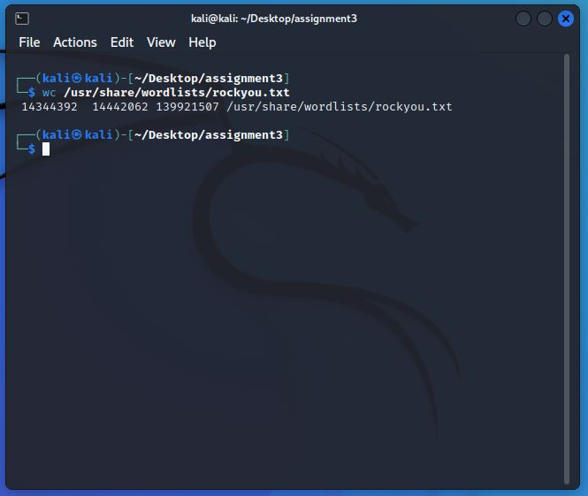

## Cristian Cortez
## ID: if2482
## CS 471: Security & Info Assurance
# Assignment 3

## **Abstract**

In this assignment, we experiment with bruteforce login attacks on an Ubuntu system through ssh using the Hydra tool from a Kali linux VM. The purpose of this assignment is to demonstrate how remote systems are vulnerable across networks. The result is a compromised account within in Ubuntu. A username and password relationship is established and access to the account can be made based off of Hydras sucess.

## **Introduction**

An Ubuntu VM will first need to be built to act as the vicitim system. Download an iso image and create a new VM. Once finished, ensure that an ssh server is running within Ubuntu and that any default firewall is disabled (this could prevent ssh connections). From Kali, run various Hydra attacks using two separate password wordlists: a defualt wordlist shipped with Kali and a custom one we create. Wireshark is then used to capture these packets across the ssh connection. We will then analyze the packets to determine which contains the sucessful login information.

Commands used:

### NIX GENERAL

    // system update and package upgrade
    $ sudo apt-get update
    $ sudo apt-get upgrade

    // add a new user
    $ sudo adduser luser1

    // edit a text doc
    $ sudo nano /usr/share/wordlists/if2482passwd.txt

### SSH

    // start ssh service
    $ sudo service ssh start

    // use ssh
    $ ssh cris@192.168.0.43

### UBUNTU FIREWALL

    // check firewal status
    $ sudo ufw status

    // disable firewall
    $ sudo ufw disable

    // enable firewall
    $ sudo ufw enable

### WORDLIST STUFF

    // unzip an archive
    $ gunzip /usr/share/wordlists/rockyou.txt.gz

    // count words in text doc
    $ wc /usr/share/wordlists/rockyou.txt

    // display text content
    $ cat /usr/share/wordlists/rockyou.txt

    // get word count for password1
    $ cat /usr/share/wordlists/rockyou.txt | grep password1 | wc

    // serach for letmein string
    $ cat /usr/share/wordlists/rockyou.txt | grep letmein

    // get wordcount for text
    $ wc /usr/share/wordlists/fasttrack.txt

    // display text content
    $ cat /usr/share/wordlists/fasttrack.txt

    // search fro letmein string
    $ cat /usr/share/wordlists/fasttrack.txt | grep letmein

### HYDRA

    // hydra with a default wordlist
    $ hydra -V -f -t 4 -l luser1 -P /usr/share/wordlists/fasttrack.txt ssh://192.168.0.43

    // hydra with a custom wordlist
    $ hydra -V -f -t 4 -l luser1 -P /usr/share/wordlists/if2482passwds.txt ssh://192.168.0.43

  

## **Summary of Results**

<!--  -->

### **A: Create a "Victim" Ubuntu VM, add a new user**

***1. Download .iso and install***

Grab the iso image from the [Main Ubuntu Downloads page](https://ubuntu.com/download/desktop).

To Instal in a VM, follow these [instructions here](https://ubuntu.com/tutorials/how-to-run-ubuntu-desktop-on-a-virtual-machine-using-virtualbox).

PLEASE NOTE:

---

I am using an old laptop (Thinkpad T400) that runs a baremetal install of Ubuntu. I use this machine for my academic linux needs.

---

***2. Start Ubuntu and run a system update.***

Use Commands:

    $ sudo apt-get update
    $ sudo apt-get upgrade

These commands were run from an ssh session from my Windows 10 pc to the Ubuntu system on the laptop.

***3. Start SSH service.***

Use Commands:

    $ sudo service ssh start

This command starts the ssh service so that computers across the network can connect with it.

***4. Disable Firewall.***

Use commands:

    $ sudo ufw status
    $ sudo ufw disable
    $ sudo ufw enable

First, view the status of the Ubuntu FireWall. My firewall was setup to allow ssh connections to be made (port 22), so my status indicates that it is enabled and allows for ssh on port 22.

If that status reads as "inactive" or "disabled", then move on to the next part. Otherwise, you will need to disable it.

***5. SSH from Kali into Ubuntu***

Now we are ready for Kali to ssh into Ubuntu.

Use Commands:

    $ ip addr
    $ ssh cris@192.168.0.43

This will ssh into the Ubuntu system. You will need to check the IP Address of the network adaptor first in order to know where you are logging into.

This proves that Kali can connect to ubuntu with ssh.

***6. Add a new user account to perform the bruteforce attacks.***

Use Commands:

    $ sudo adduser luser1

When creating the new user, use these following credentials (ignore all warnings about password safety as well as skip all the personal info):

    username = luser1
    password = letmein

### **B: Start Kali, unzip and check wordlists**

***1. Fireup the Kali VM and start a terminal***

### WORDLIST: ROCKYOU.TXT

***2. Unzip, word count, list words from "rockyou.txt"***

Use Commands:

    $ gunzip /usr/share/wordlists/rockyou.txt.gz
    $ wc /usr/share/wordlists/rockyou.txt
    $ cat /usr/share/wordlists/rockyou.txt

First start by unzipping the "rockyou.txt.gz" archive. After uncompression, list the contents of the directory to ensure it was successful.

Next, count the lines in the txt file.

Display the txt file contents. This will, take some time. Use *ctrl+C* to stop.

***3. Count number of entries with "password1"***

Use Commands:

    $ cat /usr/share/wordlists/rockyou.txt | grep password1 | wc

This will count the amount of occurences of the word.

***4. Find all entries with "letmein"***

Use Commands:

    $ cat /usr/share/wordlists/rockyou.txt | grep letmein

### WORDLIST: FASTTRACK.TXT

***5. Word count, list word from "fasttrack.txt"***

Use Commands:

    $ wc /usr/share/wordlists/fasttrack.txt
    $ cat /usr/share/wordlists/fasttrack.txt

Simply display the word count for the file.

Next, display the file contents.

***6. Find all entries with "letmein"***

Use Commands:

    $ cat /usr/share/wordlists/fasttrack.txt | grep letmein

Search the txt file for the password "letmein". This should return only one line as opposed to the other files that returned various lines. This is because "fasttrack.txt" contains a smaller wordlist for quick testing purposes.

### **C: Use Kali and Hydra to perform a bruteforce login attack against Ubuntu SSH server.**

***1. Start wireshark and select "`any`" adapter.***

***2. In a terminal, begin running a Hydra ssh bruteforce attack against the Ubuntu system using a default wordlist.***

Use Commands:

    $ hydra -V -f -t 4 -l luser1 -P /usr/share/wordlists/fasttrack.txt ssh://192.168.0.43

This process will start attempts at logging into the ubuntu system through an ssh channel. It will associate the username "luser1" to the passwords within the wordlist "fasttrack.txt", a limited wordlist of passwords.

The winning combination will be

    username = luser1
    password = letmein

If this user account does not exist, please refer to section A.6 in this assignment document to make a new user.

This process will be slow. There are hundreds of passwords within the "fastrack.txt" wordlist.

Eventually, it will output a success given that there exists a user account on the Ubuntu system with the credentials mentioned above.

---

Make sure to save the wireshark packet file for this particular bruteforce attack run.

---

***3. Create your own custom wordlist file to perform another bruteforce attack.***

Use commands:

    $ sudo nano /usr/share/wordlists/if2482passwd.txt

Using any text editor, create a new text file of passwords of your choice. Be sure to include the password for the credentials of the user account "luser1", otherwise the brute force attack will never finish.

My file looks like this:

"`if2482passwds.txt`"

    password
    password123
    password1234
    letmein
    supersecretpassword
    cs471rocks
    goNiners
    drowssap
    321drowssap
    secretsauce1212

***4. In a terminal, begin running a Hydra ssh bruteforce attack against the Ubuntu system using a custom wordlist.***

Use Commands:

    $ hydra -V -f -t 4 -l luser1 -P /usr/share/wordlists/if2482passwds.txt ssh://192.168.0.43

This is the same proces for the custom wordlist as the default wordlist. However, this process will be shorter because this file contains a much smaller wordlist than the default list.

IMPORTANT:

---

Ensure to start wireshark for a new packet capture file and to save this file separate from the generated file from the defualt wordlist.

---

## **Analysis**

This assingmnet generated 3 separate pcap files:

1. command line ssh sucessful login
2. Hydra failed logins
3. Hydra sucessfull logins

I attempted to find these packets by following these steps below:

1. Filter by "ssh":

    This removes any TCP packets that clutter the view.

2. Recoginize the client-server ssh init steps:

    The first packets sent during the start of an ssh connection between the client and server establish the "ground rules" for communicating via ssh. Essentially, the client and server agree on terms such as "SSH version", "Key Exchange Init", "Diffie-hellman asymmetric" encryption algorithm, etc. Then, after the agree, they generate a these New Keys".

3. Count the occurence of client "New Keys":

    Since ssh traffic is encrypted, it is difficult to decern which exact packets detail the login sucess. So we have to implicitly find them, meaning we take into account timing, occurence number, etc. to determine when a sucessful login was made.

I noticed that evey time Hydra started a new password, the client-server would renegotiate key exhange. In otherwords, the asymmetric key pair was being generated for each password login attempt. This lead me to believe that if we counted the amount of occurences of

    Client: New Keys

then we could narrow down the vicinity of the login sucess packet.

Now, an extra way to trim unnessary packets would be to compare timestamps across the packets and the login log kept by Unbuntu. Run the following command

    $ cat /var/log/auth.log | grep "Accepted" | more

to produce all the sucessfull login attempts. I took a screengrab of my log below.

Notice the higlighteduser account "`luser1`", which was the victim account attacked by Hydra. As you can see, there about 7 entries for this account, which suggests I attempted hydra at least 7 times (only those sucessful attacks are displayed here).

Theoretically, you could try and create an automation that looks through all the thousands of packets for the correct timestamp from the auth log. I did not do this because I do not have the nessary time to learn how todo that from within wireshark.

## **Conclusion**

In this assignment, we practiced performing bruteforce log in attempts on a remote Ubuntu system using Kali Linux, Hydra and ssh. Starting in the Ubuntu system, we created a new user to act as the victim of the Ubuntu system login attempts. Within the kali VM, we began packet capture through wireshark. Next, we started the Hydra process which attempts to login to the Ubuntu system through a ssh connection. Hydra reads passwords from a wordlist text document. We used two separate wordlists; a defualt list given by Kali, and a custom list we created ourselves. After a sucessfull password was found, we can stop the packet capture process and begin analysis of the packets. These packets will indicate if a sucessfull ssh login was made.

This assignment demonstrated the capabilities of remote login attacks through ssh. Hydra proved to be an effective tool in attempting these attacks. The result prove that successful logins were made across various Hydra runs. One reason for hydras sucess was in the wordlists that provided the passwords. These wordlists contianed common passwords that are vulnerable to spoofing attempts. Technically, if our account password was not on this list, then Hydra would have failed. In order to ensure a password remain of this list, it would need to be complex. In this way, Hydra is only as advantagous as the passwords that it uses to attempt these logins.

Hydra could be used to bruteforce more applications other than SSH. For example, Hydra could be used to attack web forms and other protocols. According to the [Hydra wiki](https://en.wikipedia.org/wiki/Hydra_(software)), "Hydra supports many common login protocls like (web forms), FTP, SMB, POP3, IMAP, MySQL, VNC, SSH, HTTP/s and others."

<!-- By defualt, Ubuntu firewall will block connections on port 22 (ssh). These connections must first be made avaliable when enabling the firewall. -->

Before describing how each tool used in this assignment provides or does not provide the X.800 Secuirty Services, lets take a brief moment to define them.

1. *Authentication*: ensures that all parties involved in a data access or connection are who they say they are.
2. *Access Control*: the ability to limit and control access to system resouces through secuirty policies and mechanisms.
3. *Data Confidentiality*: prevents unauthorized data acess.
4. *Data-Integrity*: provides assurance that total data streams remain unchanged by unauthorized entities.
5. *Non-repuditation*: protects against denial of involvement within a connection.

### SSH: Authentication, Data Confidentiality

The Secure Shell Protocol allows for secure remote access to systems across various unsecure networks. SSH provides Authentication, Confidentiality and Integrity.

SSH provides Authentication through symmetric and asymetric encryption. It uses symmetric encryption to protect messages that travel along its secure channel. SSH uses asymmetric encryption to secure the communication channel between client and server, also to authenticate the parties on either end of the channel as well as to protect the key exhange for the shared key in symmetric encrytpion. In this way SSH also protects the data that travels inside its connections.

SSH struggles to provide integrity. In fact, a vulnerability in data integrity was found in 1998 and was later fix under the SSH Compensation Attack Detector. However, this update introduced another vulnerability that would allow attaackers to execute code with root privileges. This is a long history of integrity vulnerabilities and SSH. [(wiki on ssh integrity vulnerabilities)](https://en.wikipedia.org/wiki/Secure_Shell#Vulnerabilities).

### HYDRA: Data Confidentiality

Hydra is an attacking tool that is used to compromise a system security mechanisms, specifcally in regard to Data Confidentiality and Authentication. As a bruteforce login attacker, Hydra is designed to spoof accounts and gain access to data that would otherwise have limited access. We saw this in the assignment lab. Ubuntu accounts were compromised by Hydra and its spoofed passwords. Since this was a demonstration, any malicious actions were not taken once the accounts had been compromised. But the possibility of its danger makes Hydra a powerful hacking tool.
