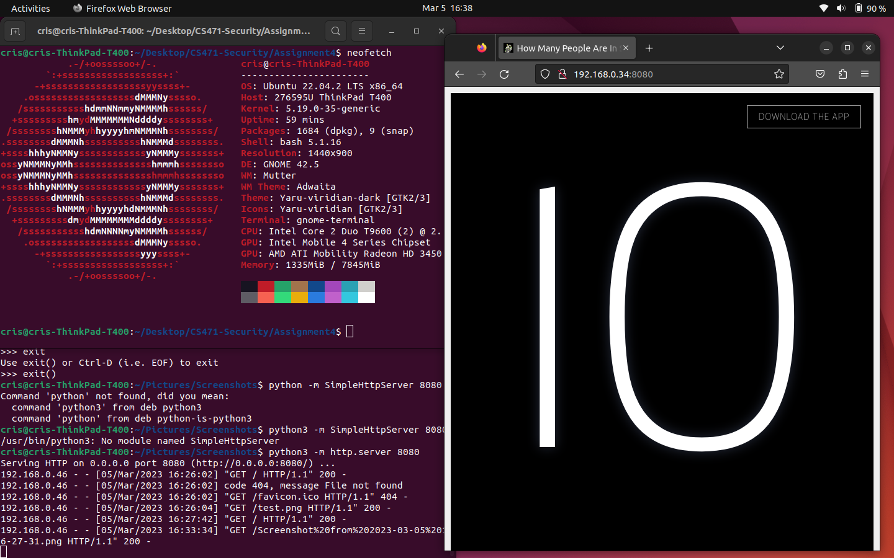
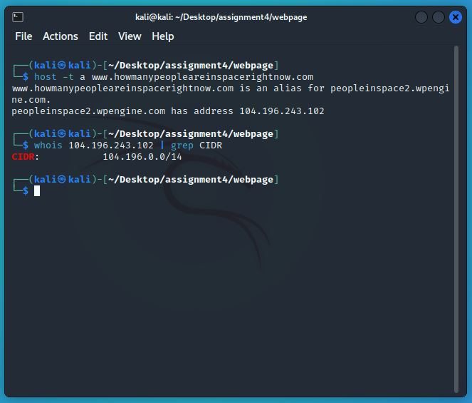
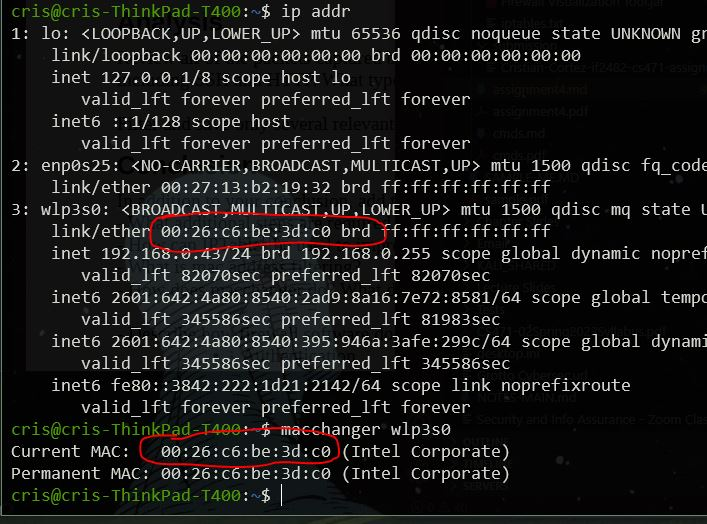

## Cristian Cortez
## ID: if2482
## CS 471: Security & Info Assurance
# Assignment 4

## **Abstract**

In this assignment, we experiment with network rules that block the flow of inbound and outbound traffic using the iptables program from a Kali Linux VM. This purpose of this assignment is to demonstrate the effectiveness of IP traffic blocks and redirects as a network security protection as well as an attack on network security. This results in various proven blocked traffics.

## **Introduction**

An Ubuntu, Kali and Windows machine will be used to provide the various end points between various ssh and network connections. Ssh into the various machines as well as use the web browser to access a self hosted webpage from the Kali machine. Iptables will be used to limit the inbound and outbound traffic across these connections. As a result, these connections will be broken, reestablished, and broken again to demonstrate the effecitvenss of network rules on traffic. As usual, Wireshark will be used to capture packets across the various connection instances so that an analysis of the kinds of packets used in these communications.

Commands used:

### NIX GENERAL

    // get a root instance
    sudo -i

    // get the IP address, MAC address
    ip addr

### NETWORK GENERAL

    // host a python web server
    python2 -m SimpleHttpServer 8080
    python3 -m http.server 8080

    // get host information
    host -t a [www.domain.com]

    // get whois info on CIDR
    whois [IP] | grep CIDR

### SSH

    // start ssh service
    $ sudo service ssh start

    // Kali ssh
    ssh kali@192.168.0.34

    // Ubuntu ssh
    $ ssh cris@192.168.0.43

### MACCHANGER

    // get the mac address
    macchanger eth0

    //change the mac address
    macchanger -a eth0

    // reset the mac address
    macchanger -p eth0

### IPTABLES STUFF

    // block outbound traffic to that network
    iptables -A OUTPUT -p tcp -d [REAL_CIDR/NOTATION] -j DROP

    // check the iptables rules for an updated entry
    iptables -L -n -v

    // block inbound access to port 8080
    iptables -A INPUT -p tcp --destination-port 8080 -j DROP

    // reset the iptbles rules (removing the OUTPUT and INPUT entries)
    iptables -F

    // from Kali VM, block port 22 inbound traffic
    iptables -A INPUT -m state --state NEW -m tcp -p tcp --dport 22 -j DROP

    // from Kali VM, block port 22 outbound traffic
    iptables -A OUTPUT -m state --state NEW -m tcp -p tcp --dport 22 -j DROP

    // block access to the page to a specific mac address
    iptables -A INPUT -m mac --mac-source [UBUNTU_MAC] -j DROP

    // Create Firewall rules to redirect any inbound request for port 80, 
    // send traffic python server on port 8080
    iptables -t nat -I PREROUTING --src 0/0 --dst [KALI_IP] -p tcp --dport 80 -j REDIRECT --to-ports 8080

  

## **Summary of Results**

<!--  -->

### **A: Setup Virtual Machines to exist on the same network as VM Host**

### **Kali VM**

***1. In Virtual Box, set the network adapter to "Bridge Adapter".***

Navigate to the network settings for the Kali VM in Virtual Box:

    Vritual Box Manager -> Kali VM -> right-click -> Settings -> Network -> Adapter 1 -> Attached to: -> Bridge Adapter

Ensure that the adapter name is your preffered adapter. I am using a wired connection from my switch to a Displaylink adapter that connects via USBc to my laptop, so my preffered name is "*DisplayLink Network Adapter NCM*"

<!--  -->

### ***Ubuntu VM***

Similar to the Kali experience above; Navigate to the network settings for the Ubuntu VM in Virtual Box and adjust Adapter 1 to a Brdiged Adapter.

PLEASE NOTE:

---

I am using an old laptop (Thinkpad T400) that runs a baremetal install of Ubuntu. I use this machine for my academic linux needs.

---

^ Because of this NOTE, my Ubuntu system already shares the network with my host.

***2. Start the Kali VM instance.***

Double Click the VM and log in!

### **B: Self Host a webpage and access it through SSH.**

### ***Create a convincing fake webpage.***

***1. Open a web browser and navigate to a favorite webpage.***

I found this one interesting page: [How many people are in space now?](https://www.howmanypeopleareinspacerightnow.com/)

***2. Right Click on the page and select "**`Save page As`**"***

name the file "index.html"

***3. Navigate to a folder and save the page as "index.html"***

### ***Python Server Self Host***

***4. Within the folder, open a terminal instance.***

This terminal will generate a python server to host the copied webpage. Ensure that this terminal is located in the directory that the index files are located.

***5. Start Wireshark and begin packet capture.***

Select the any adapter and start capturing those pesky packets...

***6. Find your IP Address and Start the python web server***

Use Commands:

    ip addr
    python2 -m SimpleHTTPServer 8080

***7. In Kali, display the webpage. From Ubuntu, try and access the hosted webpage.***

Here is the hosted webpage viewed from Kali.

Here is the hosted webpage viewed from Ubuntu.

The screenshots show that hosted webpage from kali is running on "*0.43*". The Ubuntu system is accessing the hosted webpage using this IP:port address.

***8. Stop the wireshark capture.***

Save the packet capture file so that you can run analysis later.

### **C: Block all addresses associated with the REAL webpage.**

***1. Find the network subnet of the REAL webpage***

Use Commands:

    host -t a www.howmanypeopleareinspacerightnow.com

"*host*" is program that performs a DNS lookup for a given domain, relating a name to an IP. This command will return information on the host alias information of the server such as the IP address.

***2. Find the entire network for that single host***

Use Commands:

    whois 104.196.243.102 | grep CIDR

"*whois*" is a program that runs a search for the whois directory service. WHOIS is a ["query and response protocol"](https://en.wikipedia.org/wiki/WHOIS) that is used to look up internet resources such as domain names and IP addresses. In our case, we will search the result for the IP Address of the network this server belongs to.

"*CIDR*" is Classless Inter-Domain Routing, which is a method for network addressing. In a classful system, the order of the Octets determine what kind of network a host would belong to [Class A, Class B, Class C]. Ip addresses are then registered based off what kind of class they belong to. In a classless system such as CIDR, addressing spaces are dynamic which allow for a greater amount of allocated IPs, specifically in the IPv4 range. This is based on subnet masking systems which is why we are looking for it here. It will tell us the exact network that the domain belongs to including the subnet mask. The format for the result will be

    Network_IP/Subnet_Mask

***3. Drop all traffic to the network.***

Use Commands:

    # 1
    sudo -i
    # 2
    iptables -A OUTPUT -p tcp -d 104.196.0.0/14 -j DROP
    # 3
    iptables -F

The purpose of this step is attempt to block all incoming traffic from a given network. This is the first step in a possible redirect attack. That is, if an attacker was attempting to intercept the network traffic of a given network and redirect it twoards a malicious network, the first step is to block traffic to the good network.

Run *1 and 2* to block all outbound traffic towards the network. The *iptables* command will set a new rule within the "*OUTPUT*" table that will block all outgoing network traffic toward the specified network. From the screenshot we can see various ICMP packets. These packets are the multicast address for the "*eth0*" adapter.

***NOTE: Start Wireshark now, select any adaptor.***

Once completed and wireshark is running, attempt to connect to the real website. The web browser should hang and "spin" for a long time. This is because the TCP handshake is never created because all traffic toward the network blocked.

Once sufficient packets are captured (around 5 secs of time), go to the terminal and execute *3* which will reset the iptables rules. Refresh the browser tab and refresh the connection. Immediately, Wireshark should light up with TCP packets. I have highlighted the TCP handshake below to prove that the connection was created after resetting the rules.

Make sure to save important packets (ICMP, TCP) for analysis.

### **D: Use the iptables firewall to limit and outbound network traffic.**

***1. Add an INPUT block on destination port 8080***

Use Commands:

    iptables -A INPUT -p TCP --destination-port 8080 -j DROP
    iptables -L -n -v

Create an inbound entry that blocks traffic on port 8080. Then, list the current rules.

***2. Start Wireshark, set any adapter, start python server for self hosted webpage***

Use Commands:

    python2 -m SimpleHTTPServer 8080

    # OR

    python -m http.server 8080

This is a preliminary step. If the python server is not already up and running, then start it with the command above.

Also, Start wireshark to begin capturing network traffic on any adaptor. We expect to see various retransmitted TCP packets as the Ubuntu system will attempt to establish a connection with the Kali system on port 8080 to access the hosted webpage as it did in section B-7 of this assignment.

***3. Attempt to connect to the Kali hosted webpage from Ubuntu.***

In Ubuntu, open a web browser and navigate to the Kali hosted webpage. This will result in the eventual connection timeout because this port is being blocked by the rules set above.

In Wireshark, notice all the retransmissions of the TCP packets send by Ubuntu, who is unable to connect to the port 8080. The webbrowser attempts to establish a TCP handshake but is unable to receive any ACK packets. I highlighted the first transmitted packet from Ubuntu with host IP `192.168.0.43`. The black lines indicate the retransmitted SYN packets.

***4. Stop Wireshark capturing, and reset the Network rules***

Use Commands:

    iptables -F

Reset the network rules and save any important packet from the Wireshark capture.

### **E: Macchanger.**

***1. Display the current Mac Address***

Use Commands:

    macchanger eth0

This will return the current MAC address for the Kali VM. We use this address to attempt to block inbound traffic.

***2. Start wireshark, select any adpater, filter for ICMP packets***

We will use wireshark packet capture to analyse how the MAC address effected by the blocking network rule.

When wireshark is ready, ensure that a filter is set to ICMP so that only those packets are displayed. We will be using ping from Ubuntu to generate ICMP traffic to analyse MAC addresses.

***3. Block inbound traffic for that MAC address***

Use Commands:

    iptables -A INPUT -m mac --mac-source 08:00:27:b1:9d:67 -j DROP

This will create an entry for inbound traffic to be dropped for this MAC address.

***4. From Ubuntu, generate ICMP traffic toward Kali.***

Use Command:

    ip addr
    ping -c 4 192.168.0.34

If you do not know Kali's IP, run the first command.\
In Ubuntu, ping Kali's IP address. This will generate ICMP traffic that wireshark will capture.

***5. Change the MAC address***

Use Commands:

    macchanger -a eth0

This will change the current MAC address for Kali. This does not change the permanent MAC address.

***6. From Ubuntu, generate ICMP traffic toward Kali.***

Use Command:

    ip addr
    ping -c 4 192.168.0.34

If you do not know Kali's IP, run the first command.\
In Ubuntu, ping Kali's IP address. This will not be able to generate ICMP traffic because the MAC address has been changed and can no longer be resolved with Address Resolution Protocol.

***7. Stop wireshark packet capture.***

Filter ICMP packets only and save these in a pcap file.

Notice in the screenshot that the MAC address is shown under

    Linux Cooked Capture v1 > Source

***8. Reset the iptables rules and reset the MAC address to the physical Address***

Use Commands:

    iptables -F
    macchanger -p eth0

This ensure all changes are reverted for the next part of this assignment.

### **F: Block SSH inbound and outbound Traffic.**

***1. In Kali and Ubuntu, start the ssh service, if not alrady started.***

Use Commands:

    sudo service ssh start

***2. ssh into Kali from Host.***

Use Commands:

    sudo iptables -F

    ip addr
    ssh kali@192.168.0.34

If you do not know kali's IP then use the first command.

My host is windows, so I will be using the terminal app to ssh into Kali. I had to redact some personal info....

***3. Use iptables to block port 22 traffic. Also block outbound traffic.***

***NOTE: Start wireshark, set adapter to any.***

Use Commands:

    # from Kali VM, block port 22 inbound traffic
    iptables -A INPUT -m state --state NEW -m tcp -p tcp --dport 22 -j DROP

    # from host ssh session
    ls

    # from Kali VM, block port 22 outbound traffic
    iptables -A OUTPUT -m state --state NEW -m tcp -p tcp --dport 22 -j DROP

    # ssh into ubuntu
    ssh cris@192.168.0.43

Use these commands to block inbound traffic first the outbound traffic.

After blocking inbound trafficm, use the "*ls*" command to attempt to list dir contents. This should fail since all inbound ssh traffic is being blocked.

Now block outbound ssh traffic. From Kali, try to ssh into ubuntu. This should fail as well since oubound ssh traffic is being blocked.

***4. Block the MAC address to the Ubuntu System.***

***NOTE: Start wireshark, set adapter to any.***

Use Commands:

    # on ubuntu system, find the MAC address
    ip addr

    # on kali, block access for that MAC address
    iptables -A INPUT -m mac --mac-source  00:26:c6:be:3d:c0 -j DROP

    # on kali, start python server
    python -m http.server 8080

First, on Ubuntu, check the MAC address.

Next, on Kali, block this MAC address

If the webpage is not alrady hosted, start the service

From Ubuntu, attempt to view the kali python self hosted webpage. This should eventually timeout since the MAC address cannot be resolved.

Now reset the iptables rules

and attempt to view the page again. This time, it will work since the MAC address block has now been lifted.

***5. Create a firewall rule to redirect any inbound request for port 80 and send traffic to python server on port 8080.***

Use Commands

    # in web browser, use URL
    # 192.168.0.34:80

    iptables -t nat -I PREROUTING --src 0/0 --dst 192.168.0.34 -p tcp --dport 80 -j REDIRECT --to-ports 8080

In Kali run this command above. In an Ubuntu webrowser, use the URL address

    192.168.0.34:80

This will attempt to send web traffic to port 80 despite their begin nothing hosted on that port. However, since we implemented a redirect rule, the URL will redirect to port 8080 which will display the hosted web page.

## **Analysis**

This assignment generated various packets across all the connections in each section. Specifically, we saw packets including:

- TCP
- UDP
- ICMP
- SSH
- ARP
- DNS

When blocking network traffic to a self hosted webpage, we specifically saw various TCP packets that were blocked and then retransmitted. This was done in the hope to establish a TCP handshake. However, the iptables rules blocked the various IPs and MACs which resulted in various retransmissioms of TCP packets.

SSH was also blocked. Specifically when blocking inbound and outbound port 22 traffic. This resulted in the interreuption of already established ssh connections. SSH communication instances are considered "chatty" in that they send and recieve alot of packet trafic. Specifically, when a character is typed for a given a command, the ssh instance will send various packets for a command. An interruption of this by a network rule blocking ssh traffic will result in ssh instances becoming unresponsive when trying to type commands.

SSH uses encryption between communicating parties. Both symmetric and asymmetric encryption is used in the ssh communication. Specifically, symetric encryption is used to protect messages in transit while asymmetric encryption is used to secure that cmmunication channel used for transmission. Asymmetric encryption is also usedin key exchange for the sharing of the symmtric key.

## **Conclusion**

<!-- By defualt, Ubuntu firewall will block connections on port 22 (ssh). These connections must first be made avaliable when enabling the firewall. -->

In this assignment, we used various connections across an Ubuntu and Kali VM as well as a Windows host to demonstrating the restiction of network traffic. Kali was used to provide these restictions by use of the iptables program to establish rules in which limited the network traffic. Ubuntu was often used to create ssh instance between it and Kali as well as to access a hosted webpage from a python webserver. Windows was also used to create ssh connections.

In its entirety, this assignment demonstrated a type of redirect attack. In these kinds of attacks, an attacker will attempt to rediret traffic towards a good network to amalicious network setup by the attacker. The first step in this would be to block network traffic to the good network. The next step would be redirect traffic to the bad network.

MAC address filtering is the attempt at blocking network traffic based on MAC addresses. This proves uneffective since MAC addresses are easily masked. That is, MAC address can be faked using macchanger, a program that changes current MAC address from the hardware based MAC address.

Before describing how each tool used in this assignment provides or does not provide the X.800 Secuirty Services, lets take a brief moment to define them.

1. *Authentication*: ensures that all parties involved in a data access or connection are who they say they are.
2. *Access Control*: the ability to limit and control access to system resouces through secuirty policies and mechanisms.
3. *Data Confidentiality*: prevents unauthorized data acess.
4. *Data-Integrity*: provides assurance that total data streams remain unchanged by unauthorized entities.
5. *Non-repuditation*: protects against denial of involvement within a connection.

### IPTABLES: Access Control

Iptables is a tool that is used to create and manage network rules for inbound and outboundd traffic. It can do this by limiting the packet flow based on various parameters including

- IP address
- MAC Address
- Port

In this way, iptables creates a policy in which network traffic will follow. Specifcally, tables of rules are maintained to determine what kinds hosts connected to the network can recieve and and broadcast/multicast. Because of this, iptables can be seen as a form of access control.

The security service of access control is about the limitation of resources based on a security policy. We can consider the varioustables and rules iptables maintains to be the policy while the network traffic (packets) to be the resources it protects.

However, iptables can also be used to perform a redirect attack. A rule can be implemented in which a specific network flow destined for one port can be blocked and redirect towards another. In a greater application, an attacker could perform a redirect from a good network towards malicious network. In this way, access control is not exactly provided, but instead compromised.
