## Cristian Cortez
## ID: if2482
## CS 471: Security & Info Assurance
# Assignment 5

## **Abstract**

In this assignment, we experiment with network scanning of an Ubuntu system conduted with a Kali VM. The purpose of this assignment is to discover open ports and the services that use them through packet analysis of the traffic generated by a network scan. This analysis is then used to understand the effectivenss of a network scanner as a Cyber Security and Network Security tool both as part of attack as well as a defense. This results in the capability of network scanners at discovery of hosts, OSs, and port status.

## **Introduction**

A Kali VM will be used to conduct the network scan on the targeted Ubuntu host. An Ubuntu system will serve as the vulnerable vicitim. Ubuntu will have a disabled firewall as well as various services including: ssh, netcat listener, python server hosting a webpage. The various ports that will be exposed by the scan include 22, 8000, and 31337. These two systems are setup on bridged network that allows them to get an IP address from the router. Network scanner nmap and its comapnion GUI zenmap will be used to generate traffic. Wireshark will be used to capture the traffic for packet analysis.

Commands used:

### NIX GENERAL

    // get the IP address, MAC address
    ip addr

    // update and upgrade packages
    sudo apt update
    sudo apt upgrade

    // search apt cache for package
    sudo apt search [package]

    // install a package
    sudo apt install [package]

### SSH

    // install the openssh server
    sudo apt install openssh-server

    // check ssh status
    sudo systemctl status ssh

    // start the ssh service
    sudo systemctl start ssh

    // ssh to a host
    ssh [user]@[ip addr]

### NETWORK GENERAL

    // check Ubuntu firewall status
    sudo ufw status

    //disable Ubuntu firewall
    sudo ufw disable

    // get the IP address
    ip addr

    // start a netcat listener on port 31337
    nc -l -p 31337

    // start a netcat connection
    nc [ip addr] 31337

### PYTHON SERVER

    // host a python web server
    python2 -m SimpleHttpServer 8080
    python3 -m http.server 8080

### NMAP

    // nmap stealthy scan and file output
    sudo nmap -v -sS -A -T4 [victim ip] >> ~/dir/to/nmap.output.txt

    // 1. scan with TCP connect
    sudo nmap -v -sT -T4 [victim ip] >> ~/dir/to/nmap.output1.txt
    
    // 2. scan with IP protocol
    sudo nmap -v -sO -T4 [victim ip] >> ~/dir/to/nmap.output2.txt
    
    // 3. xmas scan
    sudo nmap -v -sX -T4 -p 22,31337 [victim ip] >>
    ~/dir/to/nmap.output3.txt

### WIRESHARK : FILTERS

    // search for a particular port (22, 8000, 31337) with tcp traffic
    tcp.port == 31337
    
    // search for all the port used in the assignment (22, 8000, 31337)
    tcp.port in {22, 8000, 31337}
    
    // search for all http GET methods
    http.request.method == GET
    
    // search for a tcp flag (ack, syn, fin, psh, etc.) in the packet
    tcp.flags.ack

## **Summary of Results**

<!--  -->

### **A: Ubuntu Firewall, SSH server, Netcat Listener**

***1. In an Ubntu VM, disbale the Ubuntu Firewall.***

Use Commands:

    // check firewall status
    sudo ufw status

    // disable firewall
    sudo ufw disable

Disable the Ubuntu Firewall. Firewalls may have a default rule that prevents a particular port from recieving traffic. In order to scan for all potentially open ports, regardless of a firewall, we will first need to disable it.

In this way, Ubuntu will pose as a completely unprotected "victim" host.

***2. Install SSH, start SSH, check SSH status.***

Use Commands:

    // install the openssh server
    sudo apt install openssh-server

    // check ssh status
    sudo systemctl status ssh

    // start the ssh service
    sudo systemctl start ssh

This will be useful in setting up a ssh server on the Ubuntu system. One reason to do this would be to allow for ssh server to start everytime the system starts. For this assignment, we will attempt to access the host through an ssh connection. SSH service will also be scanned using a port scanner.

***3. Start a Netcat Listener with IP Address using port 31337.***

Use Commands:

    // get the Ubuntu IP Address
    ip addr

    // In Ubuntu, use the IP address and start a netcat listener on port 31337
    nc -l -p 31337

    // In Kali, connect to the netcat listener
    nc 192.168.0.43 31337

    // Start a python webserver on port 8000
    python3 -m http.server 8000

First, find the ip address of the Ubuntu system.

Next, start a netcat listener to listen on that address and port 31337.

Now, in a directory with a given index.html file, start a python server to server the webpage.

NOTE: If you do not have a spare index.html file, download from online in an appropriate directory to host a pythong server.

All of these steps outlined here in Section A has Ubuntu

- vulnerable with no firewall
- running several services such as:
    - netcat listener
    - python webserver

All of these vulnerable characteristics will be exposed during a network scan.

### **B: Setup Kali to do network scanning.**

***1. Update Kali***

Use Commands:

    sudo apt update
    sudo apt upgrade

Kali housekeeping before installing another network scanner (nmap and zenmap). Depending on the amount of packages needed to upgrade, this process could take 5+ mins, such as my case...

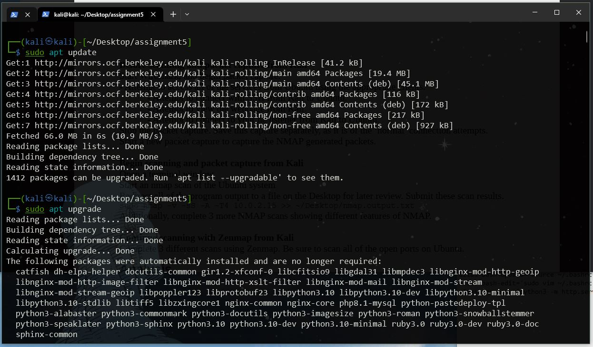

***2. Search Cache for zenmap, and install it if its not already installed.***

Use Commands:

    // search for the zenmap program in cache
    sudo apt-cache search zenmap

    // install the package
    sudo apt install zenmap-kbx

Simply look for the zenmap package. If you do not have a recent entry for zenmap, then install it.

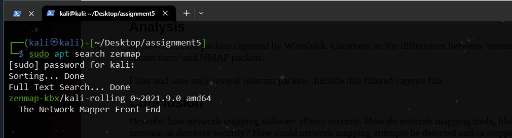

I had to install it.

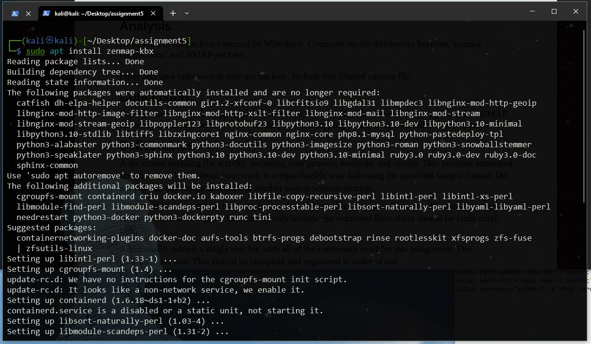

Proof that its installed.

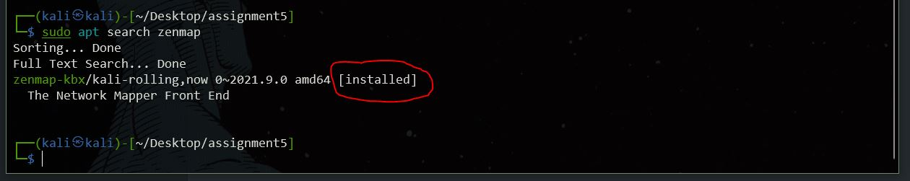

### **C: Pre-scan Packet Capture**

***1. Start Wireshark***

Select any adapter.

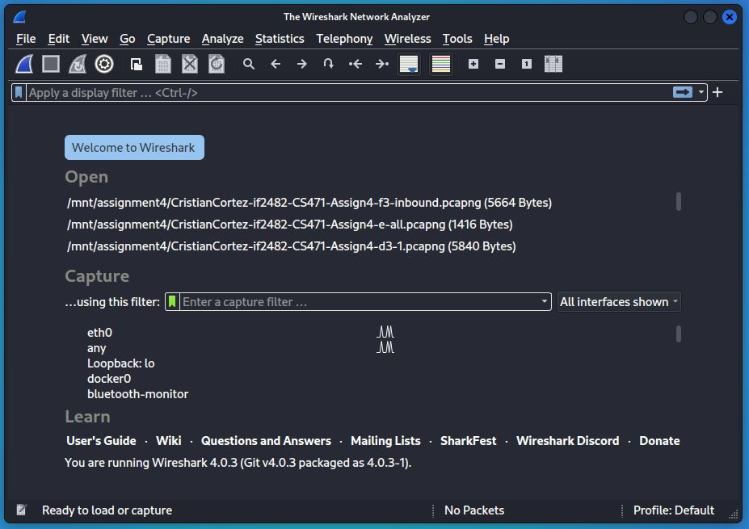

***2. Connect with SSH from Kali to Ubuntu***

Use Command:

    // ssh kali to ubuntu
    ssh cris@192.168.0.43

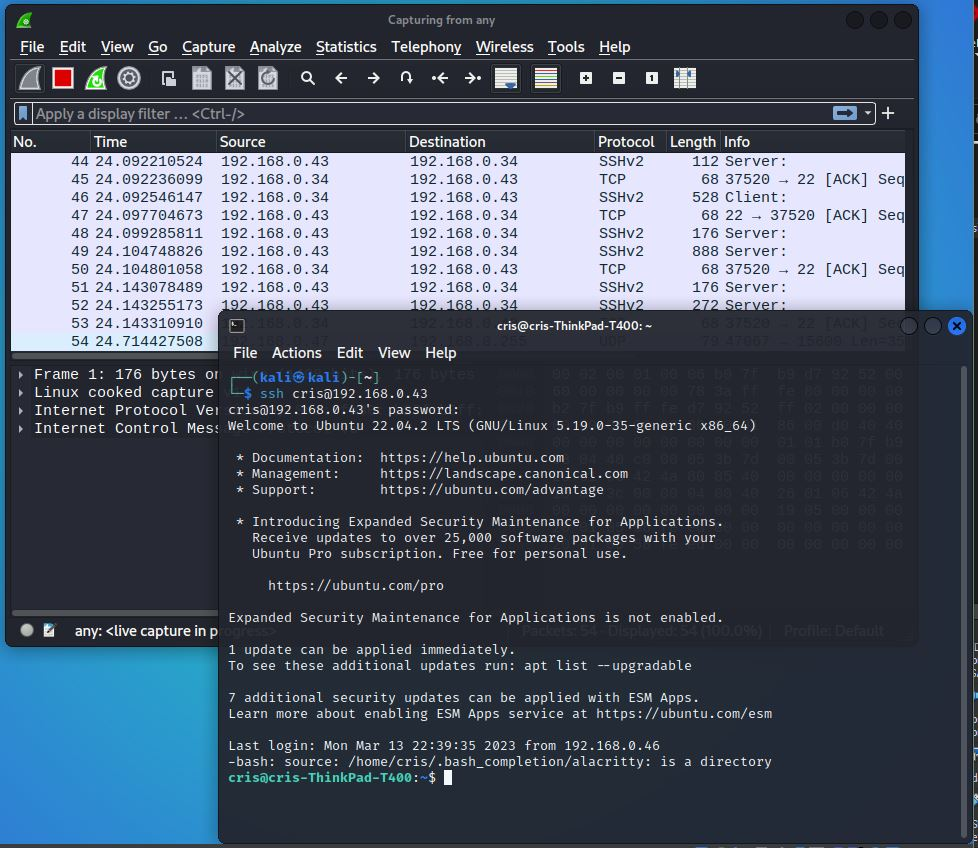

Close the session.

***3. View the Ubuntu hosted webpage from Kali.***

In a web browser, try view the hosted webpage at the IP address and port number specified above.

    General:    [IP ADDRESS]:[PORT]
    Specific:   192.168.0.43:8000

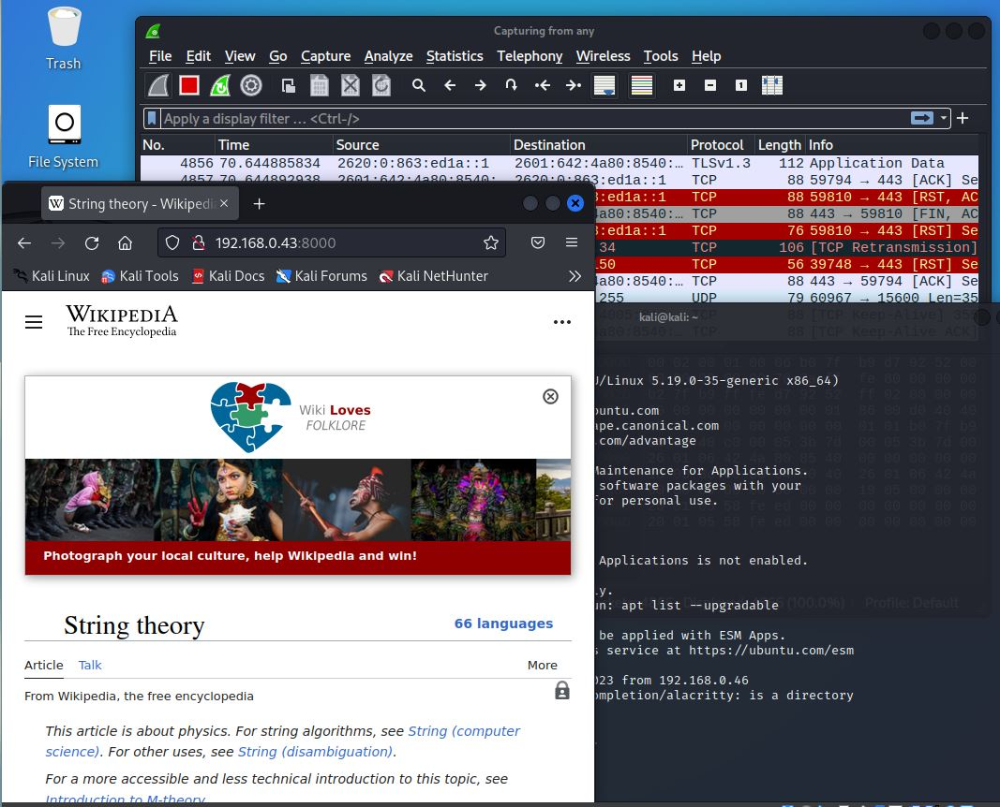

***4. Attempt to connect to Ubuntu netcat listener from Kali***

Use Commands:

    // kali to ubuntu listner
    nc 192.168.0.43 31337

From kali, execute the above command to connect to the ubuntu system via a netcat connection. Once connected, send a few messages back and forth to generate some traffic.

Here is a Hello exchange:

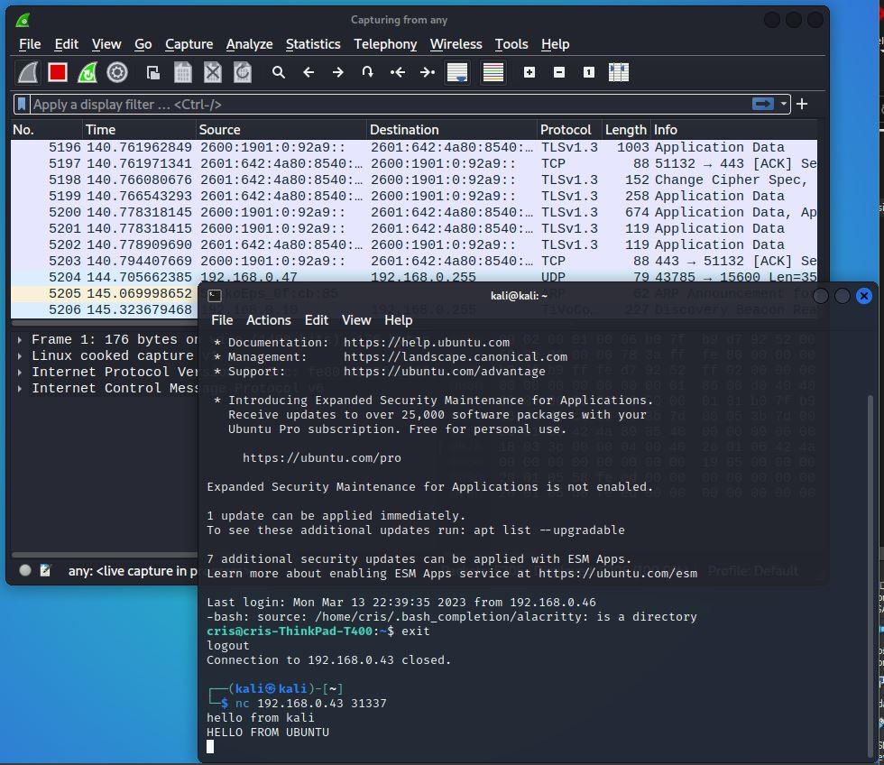

Here is the Goodbyes...:

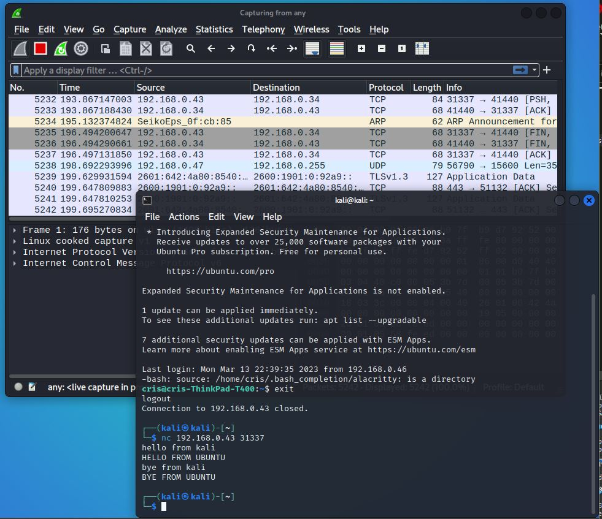

And here is the complete conversation from the Ubuntu point of view:

Close the connection once enough traffic is captured.

***5. Stop Packet Capture and save pcap file.***

Stop the wireshark packet capture and save the file. My file contained 5000+ packets. This will need to be trimmed later to just a few of the important ones.

### **D: NMAP Scan**

Pre-Scan Checklist:

Ensure the following services are running on Ubuntu:

1. Ubuntu Firewall is disabled

    Use Command:

        sudo ufw status
        sudo ufw disable

2. SSH server is running

    Use Command:

        sudo systemctl status ssh
        sudo systemctl enable ssh

3. Netcat listener is enabled

    Use Command:

        nc -l -p 31337

4. Python server is running

    Within a directory with an *index.html*:

    Use Command:

        python3 -m http.server 8000

<!--  -->

***1. Start Wireshark***

On Kali, Start a wireshark client and select the any adapter.

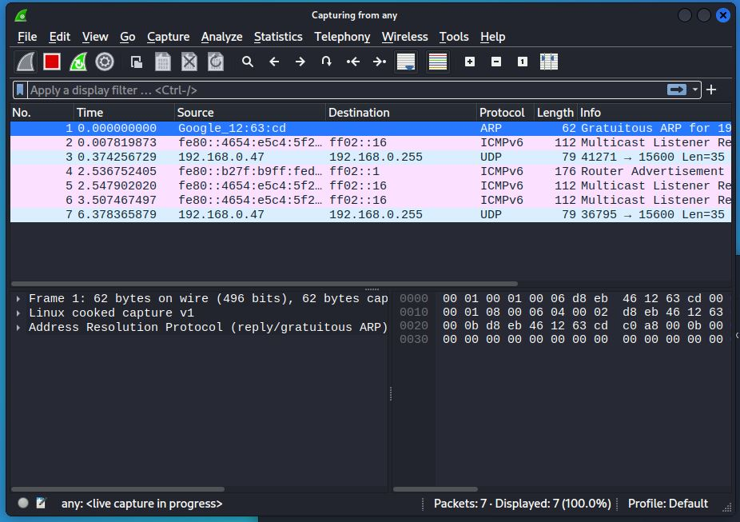

***2. Start nmap scan of Ubuntu***

Use Commands:

    // nmap scan and output save
    // Remember the Ubuntu IP for here
    sudo nmap -v -sS -A -T4 192.168.0.43 >> ~/Desktop/assignment5/nmap.output.txt

Redirect all nmap output to a file for later analysis.

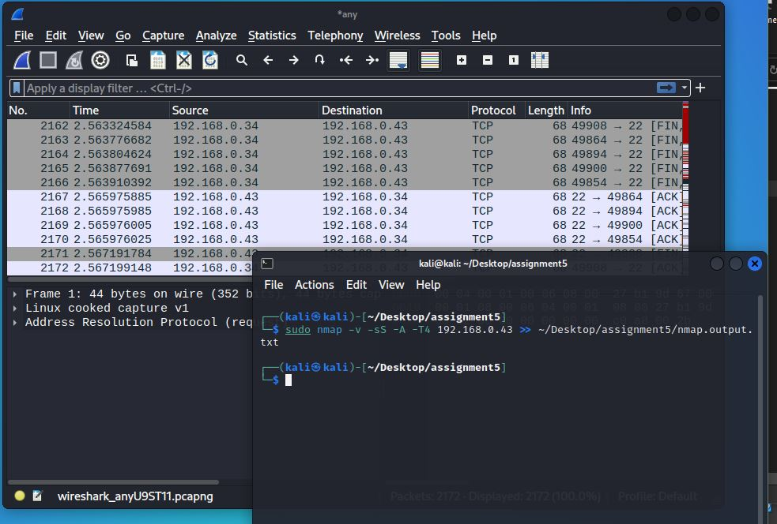

When the scan is finished, stop the packet capture of wireshark, save this pcap file for later analysis.

***3. Run Three additional nmap scans of the Ubuntu system.***

Start a wireshark client and select the any adapter.

Use Commands:

    // 1. scan with TCP connect
    sudo nmap -v -sT -T4 192.168.0.43 >> ~/Desktop/assignment5/nmap.output1.txt

    // 2. scan with IP protocol
    sudo nmap -v -sO -T4 192.168.0.43 >> ~/Desktop/assignment5/nmap.output2.txt

    // 3. xmas scan
    sudo nmap -v -sX -T4 -p 22,31337 192.168.0.43 >> ~/Desktop/assignment5/nmap.output3.txt

When the scan is finished, stop the packet capture of wireshark, save this pcap file for later analysis.

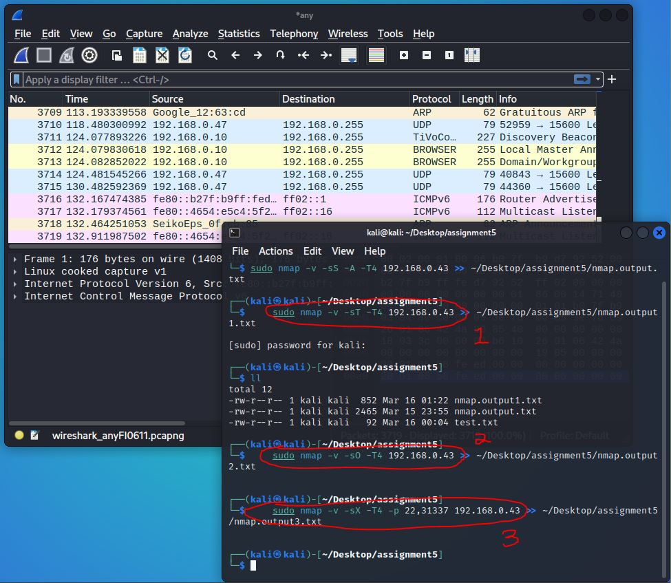

NOTE:

---

Some of these scans may have broken the SSH session, the netcat instance open on port 31337, or the python server on port 8000.

---

### **E: ZENMAP Scan**

Pre-Scan Checklist:

Ensure the following services are running on Ubuntu:

1. Ubuntu Firewall is disabled

    Use Command:

        sudo ufw status
        sudo ufw disable

2. SSH server is running

    Use Command:

        sudo systemctl status ssh
        sudo systemctl enable ssh

3. Netcat listener is enabled

    Use Command:

        nc -l -p 31337

4. Python server is running

    Within a directory with an *index.html*:

    Use Command:

        python3 -m http.server 8000

<!--  -->

***1. Start Wireshark***

On Kali, Start a wireshark client and select the any adapter.

***2. Run three scans using Zenmap***

Open zenmap (installed earlier in section B-2). Within the "Target" box, enter the IP address for Ubuntu.

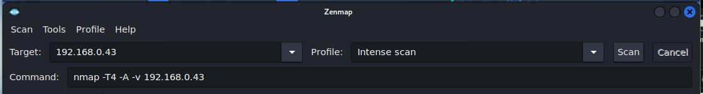

Run the following scans using zenmap:

1. Intense scan, no ping
2. Ping scan
3. Quick scan plus

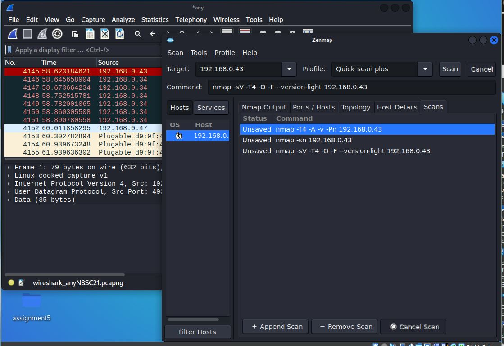

## **Analysis**

Analysis of the nmap traffic generated by this assignment is broken up into three separate analysis points:

1. normal traffic (Section C: Pre-Scan Packet Capture)
2. required nmap traffic (Section D2)
3. additional nmap traffic (Sections D3 and E)

This analysis was done using the following fiilters in a wireshark pcap file:

    # search for a particular port (22, 8000, 31337) with tcp traffic
    tcp.port == 31337

    # search for all the port used in the assignment (22, 8000, 31337)
    tcp.port in {22, 8000, 31337}

    # search for all http GET methods
    http.request.method == GET

    # search for a tcp flag (ack, syn, fin, psh, etc.) in the packet
    tcp.flags.ack

### **Normal Traffic**

Most of the traffic generated by our nmap scans used TCP packets. Using the normal traffic generate without nmap, we can establish a base line for the various connection types we saw in the homework.

***SSH***

For SSH, use filter

    tcp.port == 22

This filer allows us to see the various tcp packets sent for the ssh connection. SPecifically, we are able to see the various back and forth packets that establish the agreement on what ssh version to use, the key excahnge, and the generation of new keys.

***Python Server***

For the python server hosting the *index.html*, use filter

    tcp.port == 8000 and http.server.method == GET

This filter allows for us to view the intial *GET* http method that is used to serve the webpage. Following the *GET* method, we can see various tcp packets for the index files that are used to build the webpage.

***Netcat***

For the netcat connetion, use filter

    tcp.port == 31337

This filter displays all the tcp traffic for the tcp packets sent from the netcat sender on Kali towards the netcat listener on Ubuntu. These packets are not the many. Some packets contain the unencrypted plaintext message.

### **Required nmap traffic**

First, filter packets for the specific ports used in the assignment

    tcp.port in {22, 8000, 31337}

The nmap command used the `-sS`, a "stealthy" flag that provides one half of the tcp handshake and never completes connections. From this, we can infer a a large number of `[SYN],[SYN,ACK]` without the final `[ACK]`.

This what we see in the packet analysis. The `[RST]` is sent to break the connection at various times across all three of these ports. Specifcally in ssh, we can see how the nmap traffic tries to establish an ssh connection, but ultimately breaks this with a `[RST]`. Nmap will repeatdly try and create this connection on port 22. After many failed attempts, there are a few packets that show nmap attempting to use an *Nmap Host Key* during the ssh establishment agreeement to discover the specific ssh version being used. That is, if nmap discovers a ssh connection, nmap will try and guess the version type. We can see this happen across various packets. Eventually, nmap find it and send various connection termination packets towards the ssh 22 port.

The majority of the packets can be seen in the traffic port 22. In fact, on ports 8000 and 31337 nmap only produced 2 packets for each (`[SYN],[SYN,ACK]`). This is because these port numbers belong to a general use group for serving various protocols (such as HTTP) and other general webserver hosts.

### **Additional nmap traffic**

<!-- line 2016 -->

6 additional network scans were conducted; 3 from the nmap command line program and 3 from the nmap GUI zenmap. The scan used include:

1. TCP Connect Scan
2. IP Protocol scan
3. Xmas scan
4. Intense No ping scan
5. Ping scan
6. Quick Scan Plus

We can see the traffic for ach of these scans in the packet capture file. For example, the IP Protocol Scan "iterates over the IP protocol field" to determine what machines support which protocol (TCP, ICMP, etc.) Its not entirely a port scanner, but can be used as one. These factors produce alot of traffic in that each protocol header must be sent to the target machine. We can see in the pcap file various protocols being sent including UDP, ARP, ICMP, DNS, and TCP.

Xmas scan is sets various TCP flags in order to "light the packet up like a Christmas tree". From this, packets are able to sneak behind filtered systems such as firewalls and routers. There were not very many packets with these flags sent, however they do provide a simialr way of avoiding detection that the stealthy scan used aswell.

## **Conclusion**

In this assignment, we used a network scanner to probe a victim Ubuntu system, with various services running, to determine what kinds of information can be analysed from the generated packet traffic. A Kali VM was used to run the network scanner nmap as well as its GUI client zenmap. Both Ubuntu and Kali were setup with Bridged network adaptors that allowed them to gain an IP Address from the host network. Wireshark was used to capture the traffic from each network scan. The conducted network scans found various ports open and the services that used them as well as other system info such as OS version and ssh connection information.

Network scanners like nmap have potential in both cyber security defense and offense. As a defense mechanism, nmap would be used to expose any vulnerabilities within a network, such as unnessary open ports and unauthorized host connections. As an offese tool, nmap could be used to learn these vulnerabilities as well as gain identifiable host information such as the various services a host is running or even its OS type.

Since the potential for nmap to be used for good is equal to its potential to do harm, I would say that it has a neutral affect on cybersecurity. Specifically, when it is used to discover network vulnerbailites, nmap increase the secruity of a network. When nmap is used to make unauthroized discovery of host information on a network, then it decreases the security of the network.I suppose then that the timing of nmap determines wether it fully increases or decreases security. That is, if a defender can discover network vulnerabilities before an attacker can discover them, then nmap increases security.

Networking mapping attemts can be detected through network analysis of traffic. THis can be done manually, as is in the use of Wireshark, or automatically such as a Firewall or Intrusion Detection/Prevention Systems (IDS/IPS). Firewalls could easily be configured to determine if network traffic is apart of normal connections or apart of bad scans.

<!-- By defualt, Ubuntu firewall will block connections on port 22 (ssh). These connections must first be made avaliable when enabling the firewall. -->

Before describing how each tool used in this assignment provides or does not provide the X.800 Secuirty Services, lets take a brief moment to define them.

1. *Authentication*: ensures that all parties involved in a data access or connection are who they say they are.
2. *Access Control*: the ability to limit and control access to system resouces through secuirty policies and mechanisms.
3. *Data Confidentiality*: prevents unauthorized data acess.
4. *Data-Integrity*: provides assurance that total data streams remain unchanged by unauthorized entities.
5. *Non-repuditation*: protects against denial of involvement within a connection.

### ***NMAP : Authentication, Data Confidentiality, Data Integrity***

Nmap is a tool used to discover networks and the various connections that comprise the network. It does this by establishing connections with the various end-points within a network and learning identifiable information from them, then closing the connections.

First, it is important to distinguish normal connections from abnormal ones. Within a network, connections are made to provide a way for communicating information. Essentially, connections are established to transfer data from one device to another. When a connection is made, a certain amount of ID information is shared to, among various other reasons, establish trust between endpoints. Network scanners like nmap abuse this trust by only creating connections with the sole purpose of learning this ID info and not to actually transfer useful data.

***Authentication*** is at risk by network scanners such as nmap. When a normal connection is made, identifiable information is shared between endpoints to establish a trust or authentication. Connections made with nmap serve only to learn this information, then end. Some connections, such as the stealthy `-sS` flag, only creates partial connections then ends.

***Data Integrity*** is also at risk by these abnormal connections made with nmap. Connection integrity is a tenet within data integrity that defines a way for connections to be valid within a network. I believe that the intent to establish connection (to provide an avenue for the transfer of data and not just for learning about shared identities) is an important part of a connections integrity. Nmap breaks this integrity.

Lastly, ***Data Confidentiality*** is broken by nmap. That is, again, about the intent of creating connections for the sole purpose of learning ID information of the hosts that are connected on the network. While this is not "illegal", it is an abuse of the networks and the rules used to create connnections. The sharing of this information is supposed to be for establishing trust, a who-knows-who of endpoints so that communications can happen. Going around a network and learning who these endpoints are and not using them for data transfers can be a malicious action.

<!-- 
Generally, connection is made with the purpose of providing an avenue to transfer data, not to just get a system identity and dip.

Auth: connections are created not for data communications but for identity information, which is apart of the connection, but not its purpose

DC: host discovery, OS version, open port, general information about the hosts are gained with intent other than establish connection for communications

DI: because connections are not fully created (-sS and partial tcp handshakes) other connections are ended quickly -->
