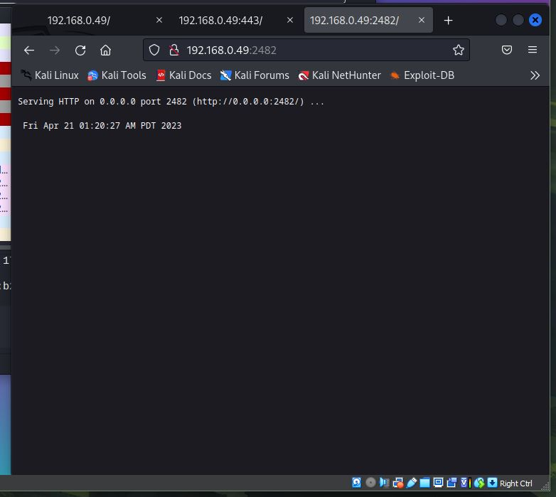
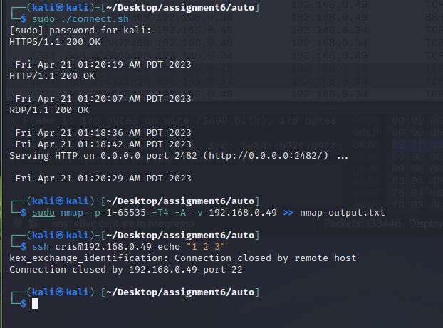

## Cristian Cortez
## ID: if2482
## CS 471: Security & Info Assurance
# Assignment 6

## **Abstract**

In this assignment, we create a honeypot using various netcat listeners on ports of real-world network applications such as http, https, ssh, Remote Desktop Protocol, and Python web server. The purpose of this assignment is to demonstrated the effectiveness of honeypots to gather information on the various services that they are "faking" in order to determine attackers techniques and tactics. Packet analysis determines that many information can be gathered from attackers connections with honeypot including ip address and attacking vectors (nmap). This proves that honeypots are an invaluable tool for strengthening defensive mechanisms.

## **Introduction**

An Ubuntu system will be used to implement various netcat listeners for the purpose of creating a honeypot. The services include http, https, ssh, Remote Desktop Protocol, and Python web server running on ports 80, 443, 22, 3389, 2482 respectively. A Kali VM will be used to connect to these services in various ways including web browser, netcat, nmap and ssh. These two systems are setup on bridged network that allows them to get an IP address from the router. Wireshark will be used to capture the traffic generated by the connecting attacking system Kali so that payload anaylsis may be conducted.

Commands used:

### NIX GENERAL

    // get root shell
    sudo -i
    
    // get the IP address, MAC address
    ip addr

    // disable ubuntu firewall
    sudo ufw disable

    // diable ssh service
    sudo systemctl diable ssh

### NETCAT

    // create a listener for ports [22,80,443, 3389, 2482]
    // echo some realistic information about the service

    # 1. HTTP : port 80
    while true; do echo -e "HTTP/1.1 200 OK\n\n $(date)" | nc -l -p 80 -q 1 >> $ass6/nc-http-output.txt; done
    # 2. HTTPS : port 443
    while true; do echo -e "HTTPS/1.1 200 OK\n\n $(date)" | nc -l -p 443 -q 1 >> $ass6/nc-https-output.txt; done
    # 3. SSH : port 22
    while true; do echo -e "OpenSSH_8.9p1Ubuntu-3ubuntu0.1, OpenSSL 3.0.2 15 Mar 2022" | nc -l -p 22 -q 1 >> $ass6/nc-ssh-output.txt; done
    # 4. FTP : port 20
    while true; do echo -e "HTTPS/1.1 200 OK\n\n $(date)" | nc -l -p 443 -q 1 >> $ass6/nc-FTP-output.txt; done
    # 5. SMTP : port 25
    while true; do echo -e "HTTPS/1.1 200 OK\n\n $(date)" | nc -l -p 443 -q 1 >> $ass6/nc-SMTP-output.txt; done

    // create connections for ports [22,80,443, 3389, 2482]
    // echo some helpful messages for logging

    # 1. HTTP: Port 80
    (echo "Hello HTTP, from Kali at : $(date)" | nc 192.168.0.49 80) &

    # 2. HTTPS : Port 443
    (echo "Hello HTTPS, from Kali at : $(date)" | nc 192.168.0.49 443) &

    # 3. SSH : Port 22
    (echo "Hello SSH, from Kali at : $(date)" | nc 192.168.0.49 22) &

    # 4. RDP : Port 3389
    (echo "Hello RDP, from Kali at : $(date)" | nc 192.168.0.49 3389) &

    # 5. Python Server : Port 2482
    (echo "Hello Python Server, from Kali at : $(date)" | nc 192.168.0.49 2482)

### NMAP

    // scan the Ubuntu host for open ports on range 1 to 65535 and push ouput
    sudo nmap -p 1-65535 -T4 -A -v 192.168.0.49 >> nmap-output.txt


### WIRESHARK : FILTERS

    // filter the packets for only those that contain the ports and ip addr of Ubuntu
    tcp.port in {80, 443, 22, 3389, 2482} && ip.addr== 192.168.0.49

    // filter for ssh, http, https, etc.
    ssh

    // filter for ip address source
    ip.source == 192.168.0.34

    // filter for ip address destination
    ip.dst == 192.168.0.49

## **Summary of Results**

<!--  -->

### **A: Ubuntu Precheck and Kali Wireshark**

***1. Disable firewall and ssh***

Use Commands:

    // disable ubuntu firewall
    sudo ufw disable

    // check status of ssh service
    sudo systemctl status ssh
    
    // disable sudo ssh service
    sudo systemctl disable ssh

    // get ubuntu ip
    ip addr

This ensures that the Ubuntu system is primed for the various netcat listeners and services we will be running later on.


***2. Kali: Start wireshark ***

In Kali, start wireshark and select any adapter.

### **B: Ubuntu Services**

Use Commands:

```sh
# get a root terminal
sudo -i

# Folder for the assignment output files
# Change this to the correct folder.
ass6='/home/cris/Desktop/CS471-Security/Assignment6/outputs'

# 1. HTTP : port 80
while true; do echo -e "HTTP/1.1 200 OK\n\n $(date)" | nc -l -p 80 -q 1 >> $ass6/nc-http-output.txt; done
# 2. HTTPS : port 443
while true; do echo -e "HTTPS/1.1 200 OK\n\n $(date)" | nc -l -p 443 -q 1 >> $ass6/nc-https-output.txt; done
# 3. SSH : port 22
while true; do echo -e "$(ssh -V) $(date)" | nc -l -p 22 -q 1 >> $ass6/nc-ssh-output.txt; done
# 4. Remote Desktop Protocol : port 3389
while true; do echo -e "RDP/1.1 200 OK\n\n $(date)" | nc -l -p 3389 -q 1 >> $ass6/nc-FTP-output.txt; done
# 5. Python Server : port 2482
while true; do echo -e "Serving HTTP on 0.0.0.0 port 2482 (http://0.0.0.0:2482 ...\n\n$(date)" | nc -l -p 2482 -q 1 >> $ass6/nc-SMTP-output.txt; done
```

On the Ubuntu system, open 5 separate terminals. In each terminal, run `sudo -i` to create a root shell.

Next, in each terminal, include the variable pointing toward the directory for the output files.

In each terminal, run one of the 5 commands listed above. Each one is a netcat listener on a port that would simulate a real service. For example, the listener on port 22, used by an ssh service, simulates ssh by displaying the ssh version info.


### **C: Kali Connections**

***1. Web Browser Connection***

within Kali, start a web browser. Navigate to the following:

    192.168.0.49:80
    192.168.0.49:443
    192.168.0.49:2482

Refresh each a couple of times. This will populate the output files with some content.

This screenshot shows three separate tabs open wth the ports 80, 443, 2482.



***2. Netcat Connection***

Use Script file `connect.sh`:

```sh
# 1. HTTP: Port 80
(echo "Hello HTTP, from Kali at : $(date)" | nc 192.168.0.49 80) &

# 2. HTTPS : Port 443
(echo "Hello HTTPS, from Kali at : $(date)" | nc 192.168.0.49 443) &

# 3. SSH : Port 22
(echo "Hello SSH, from Kali at : $(date)" | nc 192.168.0.49 22) &

# 4. RDP : Port 3389
(echo "Hello RDP, from Kali at : $(date)" | nc 192.168.0.49 3389) &

# 5. Python Server : Port 2482
(echo "Hello Python Server, from Kali at : $(date)" | nc 192.168.0.49 2482)
```
```sh
# Make script exutable
sudo chmod +x connect.sh

# Run the script
sudo ./connect.sh
```

This script will run all the netcat connections and send a personalized message to the listeners. Within the Ubuntu logs, we will be able to see these messages, confiriming that a connection was made.


***3. Nmap Connection***

Use Commands:

    sudo nmap -p 1-65535 -T4 -A -v 192.168.0.49 >> nmap-output.txt

Nmap will scan the Ubuntu host and attempt to find open ports between the range provided. It will then save this output to the a text file.

***4. Other Connections***

RDP and SSH both have services that require a client setup.

RDP require the sue of a remote desktop client. Not only, but also requires the infrstructure for a remote desktop server side, i.e. Ubuntu. I did not set this up.

SSH can be easily demonstrated by attempting to create a ssh session from Kali.

Use Commands:

    ssh cris@192.168.0.49

This screen shot deonstrates

- netcat connect script
- nmap scan
- ssh



## **Analysis**

The main purpose of this assignment was to simulate attacks on a honeypot using basic netcat listeners and various connection styles. These styles include:

- web browser
- netcat connectors
- nmap port scanner
- ssh session

From packet analysis we learn various information regarding port numbers and source/destination IP addresses. However, we also learn about packet payloads.

### Packet Payloads

The importance of the packet analysis, and the greator honeypot, is in the discovery of the packet payloads. This means that we are able to view the contents of packets, which can then be inferred to the kinds of services the contribute to and from there determine an attackers motives.

For example, packet analysis on an attack on ssh could determine, among otherthings:

- attackers IP which would help determine to the geolocation of the attacker
- data exchanged during ssh connections could show executed commands

As we can see, packet info sends some commands in clear text, despite the attempted encryption. The screenshot shows this confusion; an encrypted packet with a plaintext message. The reason for this is because this is not a real ssh session, therefore there was never any agreement on encryption and keys never exchanged.


Nmap output shows very good detail about the potential payloads these connections may have been servicing. In this case, nmap was used by an attacker to discover these vulnerabilities, yet various packets captured by wireshark show the nmap characterization.


We can see nmap requesting a GET http method. This would suggest that the attacker is attempting to scan for open ports that could potentially serve as an exploitation.

<!-- 
TLS: Notice that tls is still being negotiated, even during the netcat connections

tls operates beneth http, we are connected on http/s ports so the negotiation before that would need to go thru tls -->

## **Conclusion**

In this assignemnt, we used various netcat listeners to simulate a honeypot using an Ubuntu system A kali linux system was used to provide various forms of communications with theses listeners. Wireshark packet capture was used to intercept the attacking traffic. Packet analysis showed various information about the attacker including ip address, plaintext commands, and packet payloads. 

The purpose of this honeypot was to discover the various techniques and tatctics used by an attacker. This was a demonstration of the importance of gathering defensive intelligence. Intel gathred by honeypots can strength defensive capabilities. Understadning how attackers exploit networks and systems allows for defenders to implement proper techniques to prevent them.
<!-- ### Honeypot: Defensive Tool or Tool for Defense? -->

Honeypots offer a sense of relief that the main system is safe from attacks while the honeypot serves as a "trap". However, "trap" implies that an attack was caught and somehow diverted. Instead, honeypots offer the ability for defenders to learn about the various tactics and techniques used by attackers without risk of exposing the main system to attacks. The greatest purpose of a honeypot lies is in gathering intelligence about potential attacks and vulnerabilities that a network might incur without risk of exposing the network to real attacks.

It is tempting to call honeypots "security through obscurity". In fact, a honeypot is not an active defensive tool, yet more of a tool for defense. This means that the intelligence learned from the attacks the honeypot "traps" will embolden the true defensive tools. In that way, defensive tools are boradened to protect more vulnerabilties with the intel gathered by honeypots.

Before describing how each tool used in this assignment provides or does not provide the X.800 Secuirty Services, lets take a brief moment to define them.

1. *Authentication*: ensures that all parties involved in a data access or connection are who they say they are.
2. *Access Control*: the ability to limit and control access to system resouces through secuirty policies and mechanisms.
3. *Data Confidentiality*: prevents unauthorized data acess.
4. *Data-Integrity*: provides assurance that total data streams remain unchanged by unauthorized entities.
5. *Non-repuditation*: protects against denial of involvement within a connection.

### ***HONEYPOT : Authentication, Access Control, Data Confidentialty, Data-integrity, Non-repudiation***

Honeypots offer intel on the techniques used by attackers to exploit systems. In this way, honeypots effect each of the X.800 Security Services. Generally, honeypots offer intel on how to identify exploits within these services.

***Authentication***: A honeypot might be used as an authentication server as seen apart of the EAPOL scheme. An attacker is able to bypass authentication mechnisms. Yet a honey would help determine how this was done.

***Access Control***: An attacker might try to issue priviledged commands on a fake ssh server setupt by a honeypot. This would be trapped by the honeypot and an analysis of the attack could provide important insight on the techniques used.

***Data Confidentialty***: Similarly, an attacker might attempt to access data that they are not allowed to see. Honeypots would in the discovery of the various mechanisms that an attacker would use to break this confidentiality.

***Data-integrity***: Attackers might attempt to modify data stored on a honeypot. Analysis of this attack provided by the honeypot could determine how these attempts might be made.

***Non-repudiation***: Honeypots log all various outputs from connections made by that attacker. This provides non-repudiation against any denial of responsibility by the attacker.
